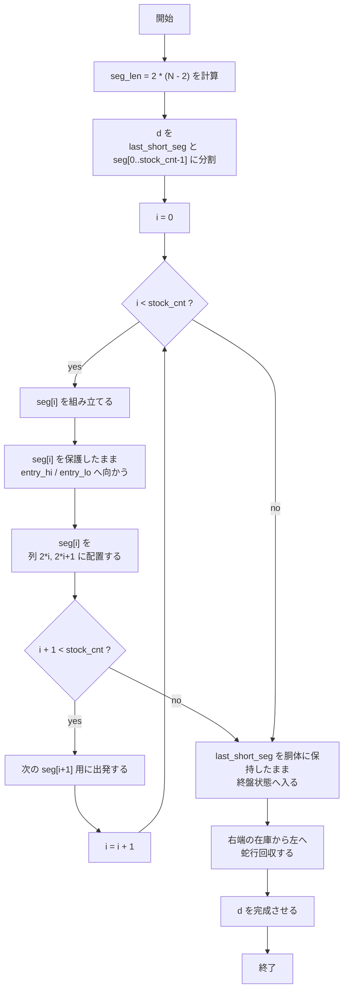

# Inventory Strategy Notes

## Notation

- `N`
  - 盤面サイズである。

- `M`
  - 目標色列 `d` の長さである。

- `d`
  - 最終的にヘビが先頭から一致させたい目標色列である。

- `d[0..5)`
  - 常にヘビが先頭 5 要素として保持すべき固定 prefix である。

- `seg_len`
  - `seg_len = 2 * (N - 2)` で定義する。
  - 在庫 1 本分の長さである。

- `stock_cnt`
  - `stock_cnt = (M - 5) / seg_len` で定義する。
  - 盤面に full segment として在庫配置する本数である。

- `last_short_seg`
  - `last_short_seg = d[5 .. M - stock_cnt * seg_len]` で定義する。
  - `seg_len` 未満の長さを持つ、先頭側に残る最後の短い segment である。
  - これは盤面に在庫配置せず、胴体に保持したまま終盤の蛇行回収へ入る。

- `seg[i]`
  - `0 <= i < stock_cnt` に対して
    `seg[i] = d[M - (i + 1) * seg_len .. M - i * seg_len]`
    で定義する。
  - `d` の後ろ側から切り出した長さ `seg_len` の full segment である。
  - `seg[0]` が最も末尾側、`seg[stock_cnt - 1]` が `last_short_seg` の直後に来る segment である。

- `used_col`
  - `seg[i]` 構築中に `col < 2 * i` を満たす列が `used_col` である。
  - これはヘビの進入禁止列領域である。
  - ここにはすでに `seg[0], seg[1], ..., seg[i-1]` が在庫配置されている。

- `entry_hi`
  - `entry_hi = (N - 2, 2 * i + 1)` で定義する。
  - `seg[i]` 配置時に右側から突入する上側 entry である。

- `entry_lo`
  - `entry_lo = (N - 1, 2 * i + 1)` で定義する。
  - `seg[i]` 配置時に右側から突入する下側 entry である。

- `entry`
  - `entry = (N - 1, 2 * i)` で定義する。
  - `entry_hi / entry_lo` から正規化手順を経たあとに到達する、固定配置手順の入口である。

- `pre_hi`
  - `pre_hi = (N - 2, 2 * i + 2)` で定義する。
  - `entry_hi` に `L` で入る直前の位置である。

- `pre_lo`
  - `pre_lo = (N - 1, 2 * i + 2)` で定義する。
  - `entry_lo` に `L` で入る直前の位置である。

## Segment Decomposition

目標色列 `d` は

`d = d[0..5) ++ last_short_seg ++ seg[stock_cnt - 1] ++ seg[stock_cnt - 2] ++ ... ++ seg[0]`

とみなす。

ここで

- `seg[0], ..., seg[stock_cnt - 1]` は盤面在庫として配置する部分
- `last_short_seg` は胴体に保持したまま最後の蛇行回収へ持ち込む部分

である。

## Process Overview

### seg[i] を組み立てる

この段階の目的は、`used_col` を使わずに先頭 5 色 `d[0..5)` を維持したまま、
`seg[i]` をヘビの先頭側に正確に組み立てることである。

ここではまだ entry への運搬や 2 列配置は考えない。
この段階の成功条件は、ヘビの先頭 `5 + seg_len` 要素が
`d[0..5) ++ seg[i]`
に一致することである。

具体的には、一時目標色列
`tmp_d = d[0..5) ++ seg[i]`
を定義し、`used_col` への進入を禁止した状態で
`v139_refactor_v137.rs` の `grow_to_target_prefix` 系の探索を行う。

要するに、この段階は
「禁止列付きで `tmp_d` を exact に作る段階」
である。

実装メモ:

- 現行実装では `v144_dead_code_cleanup.rs` の `inventory_run_segment_phase()` が
  各 `seg[i]` phase 全体を束ねている。
- その中で `inventory_segment_target()` が
  `tmp_d = d[0..5) ++ seg[i]` を構成する。
- さらに `push_movement_constraint(movement_constraint_with_min_col(2 * seg_idx))`
  を phase 全体に張ることで、`used_col < 2 * i` の列を探索と drop の両方で禁止している。
- `seg[i]` を実際に exact に組み立てる主担当は
  `inventory_build_target_exact()` であり、
  その中核は `grow_to_target_prefix()` の呼び出しである。
- ~~現時点では、`### seg[i] を組み立てる` に対応するこの構成
  (`movement_constraint_with_min_col` + `inventory_build_target_exact` + `grow_to_target_prefix`)
  はうまくワークしており、
  失敗ケースの主因はこの build phase 以外にあるとみなしてよい。~~ と思ったら出発phase後失敗パターンがあった。

### seg[i] を保護したまま entry_hi / entry_lo へ向かう

この段階の目的は、ヘビの先頭 `d[0..5) ++ seg[i]` を壊さないまま、
`seg[i]` を 2 列配置するための入口まで運搬することである。

ここではまだ `seg[i]` を盤面に配置しない。
また、実際の探索目標は `entry_hi / entry_lo` そのものではなく、
右側から最後に `L` を 1 手打って `entry_hi / entry_lo` に進入し、
`entry_hi` に入った場合は `D -> L`、
`entry_lo` に入った場合は `L`
を打って `entry` へ接続できる姿勢を作ることである。

この段階の成功条件は、

- `entry` 到達時、`seg[i]` を壊していないこと
- かつ、その後「`seg[i]` を列 `2*i, 2*i+1` に配置する」固定手順を実行すると
  `seg[i]` が所定の位置に収まっていること
  (つまり固定手順での配置中に列 `2*i, 2*i+1` の `entry_hi`, `entry_lo` 以外で自己 bite が起きていないこと)

である。

この運搬中も `used_col` には進入してはいけない。
また、先頭 `5 + seg_len` 要素
`d[0..5) ++ seg[i]`
は保持し続けなければならない。

これより後ろに余計な suffix が付くこと自体は許されるが、
`seg[i]` 本体を壊してはいけない。

要するに、この段階は
「禁止列付きで `d[0..5) ++ seg[i]` を保護しながら、
右側から `entry_hi / entry_lo` に入り、
固定配置手順へ安全に接続できる姿勢まで運ぶ段階」
である。

### seg[i] を列 `2*i, 2*i+1` に配置する

この段階の目的は、ヘビの持つ `seg[i]` を
列 `2*i, 2*i+1` に在庫として固定配置することである。

この段階は、すでに `entry` に到達しており、
`seg[i]` が壊れていない状態から始まる。

具体的には、次の固定手順を実行する。

- `U` を `N - 1` 回
- `R`
- `D` を `N - 3` 回
- `D`
  - 意図した self-bite が起こる可能性がある。
  - 余計な suffix が切り離される可能性がある。
  - これは許される。
- `D`
  - 意図した self-bite が起こる可能性がある。
  - 余計な suffix が切り離される可能性がある。
  - これは許される。
- `L`
- `U`
- `R`
  - ここで意図した self-bite により、
    `seg[i]` をヘビ本体 (先頭 5 要素) から切り離す。

この段階の成功条件は、

- ヘビ本体の長さが 5 に戻っていること
- `seg[i]` が列 `2*i, 2*i+1` の所定の位置に収まっていること

である。

具体的な配置結果は次の通りである。

- `seg[i][0 .. N-2)` は列 `2*i+1` に逆順で配置される
- `seg[i][N-2 .. 2*(N-2))` は列 `2*i` に正順で配置される

すなわち、

- `(0, 2*i+1), (1, 2*i+1), ..., (N-3, 2*i+1)` に
  `seg[i][N-3], seg[i][N-4], ..., seg[i][0]`
- `(0, 2*i), (1, 2*i), ..., (N-3, 2*i)` に
  `seg[i][N-2], seg[i][N-1], ..., seg[i][2*(N-2)-1]`

が対応する。

また、`seg[i]` を切り離したあとのヘビ本体は、
`(head, body, body, body, tail)` の順で

- `(N-2, 2*i+1)`
- `(N-2, 2*i)`
- `(N-1, 2*i)`
- `(N-1, 2*i+1)`
- `(N-2, 2*i+1)`

の座標に対応する。

この状態になったとき、配置 phase は完了したと定義する。
また、この状態を次の出発 phase の開始状態とする。

実装メモ:

- 現行実装では `v144_dead_code_cleanup.rs` の `place_inventory_segment()` が
  この phase の入口である。
- 実際の固定配置手順本体は `inventory_place_from_entry()` に入っている。
- `inventory_place_from_entry()` は
  `entry_hi` なら `D -> L`、`entry_lo` なら `L` で `entry` に正規化したあと、
  固定手順
  `U^(N-1) -> R -> D^(N-2) -> D -> L -> U -> R`
  をそのまま実行する。
- この関数は各手で
  - `protect_len` を壊していないか
  - 許可していない位置で自己 bite が起きていないか
  - 最後の `R` で意図した切断が起き、長さ 5 に戻るか
  を同時に検証している。
- さらに transport 側でも `inventory_transport_finish_kind()` /
  `try_commit_inventory_entry_and_validate_place()` を通して、
  entry 到達後にこの配置 phase が最後まで通ることを dry-run で確認している。
- 現時点では、`### seg[i] を列 2*i, 2*i+1 に配置する` に対応するこの構成
  (`place_inventory_segment` + `inventory_place_from_entry`)
  はうまくワークしており、
  failure の主因はこの配置 phase そのものではないとみなしてよい。

### 次の `seg[i+1]` 用に出発する

この段階の目的は、`seg[i]` を配置し終えた直後の状態から抜け出し、
次の `seg[i+1]` を構築できる状態へ移ることである。

この段階の成功条件は、

- 次 phase の禁止列条件 `col < 2 * (i + 1)` を適用しても、
  ヘビの body がその領域に残っていないこと
- このとき、tail が残ってよいのは
  `(N-2, 2*i+1)` または `(N-1, 2*i+1)` のどちらかだけであること

である。

ここで tail が列 `2*i+1` に残ること自体は許される。
なぜなら、その状態から self-bite が起きても、
tail は 1 つ右へずれて落ちるため、
列 `2*i, 2*i+1` に餌を drop しないからである。

これを実現するには、
`col >= 2 * (i + 1)` の領域で
4 つ以上の空白マスを self-bite なしで通過すればよい。

配置 phase 完了直後のヘビ本体は
`(N-2, 2*i+1) -> (N-2, 2*i) -> (N-1, 2*i) -> (N-1, 2*i+1) -> (N-2, 2*i+1)`
という 5 マスの形をしている。

この状態から出発 phase で最初に `R` あるいは `D -> R` を選んだあと、
さらに 4 つ以上の空白マスを self-bite なしで通過すると、
body は禁止列領域から順に押し出される。
その結果、`col < 2 * (i + 1)` の領域に残ってよいのは
列 `2*i+1` の `N-2` 行または `N-1` 行にある tail だけになる。

実装メモ:

- `v147_prepare_first.rs` で分かった重要な点は、
  parked state (`len = 5`) から次 phase に入るときの failure が
  「出発不能」ではなく、
  parked state での `direct_build` が重すぎて
  `prepare -> build_exact` に使うべき時間を先に消費していたことによる場合がある、ということである。
- 現行実装では `inventory_run_segment_phase()` の先頭で
  parked state に対して `inventory_try_direct_build_from_current()` を試すが、
  これは短時間の exact check に制限している。
- そのうえで、本命の
  `inventory_prepare_build_start() -> inventory_build_target_exact()`
  に十分な時間が残るようにしている。
- さらに `len <= 6` の build 開始時には、
  初回 `grow_to_target_prefix()` にやや厚めの予算を与えることで、
  出発直後の build が budget 不足で落ちるケースを防いでいる。
- したがって、この章で注意すべき failure は
  「出発そのものに失敗する」だけでなく、
  「出発後の build phase に渡す時間を削りすぎる」ことも含む。

### `last_short_seg` を胴体に保持したまま終盤状態へ入る

full segment の在庫配置をすべて終え、`last_short_seg` のヘビ本体への構築が終わったときに発動する。

この段階の目的は、ヘビを最後の蛇行回収へ入るための開始状態を作ることである。

ここでは新たな在庫配置は行わない。
この段階でやるべきことは、

- ヘビの先頭を `d[0..5) ++ last_short_seg` に一致させること
- その状態を壊さないまま、head を `(N - 3, 2 * stock_cnt - 1)` へ運ぶこと

である。

`last_short_seg` の構築方法は `seg[i]` を組み立てる段階と同じであり、
対象が full segment ではなく、より短い `last_short_seg` になっているだけである。

この段階の成功条件は、

- head が `(N - 3, 2 * stock_cnt - 1)` にあること
- その時点で、ヘビの先頭が `d[0..5) ++ last_short_seg` に一致していること

である。

実装メモ:

- 現行実装では `v145_harvest_repair.rs` の `inventory_build_tail_exact()` が
  `d[0..5) ++ last_short_seg` に対応する `tail_colors` を exact に組み立てる。
- これは `inventory_run_segment_phase()` の short segment 版とみなしてよく、
  entry transport / 配置 phase だけを持たない。
- その後の終盤入口への移動は `inventory_finish_harvest()` が担当し、
  内部で `inventory_transport_harvest_entry()` により
  `tail_colors` を保護したまま harvest 開始可能な姿勢まで運ぶ。
- `v145_harvest_repair.rs` ではこの transport に
  self-bite 後の高速復旧 (`repair_prefix_after_bite()`) を組み込んでおり、
  現時点ではこの章の処理は安定してワークしている。

### 右端の在庫から左へ蛇行回収する

この段階では、head が `(N - 3, 2 * stock_cnt - 1)` にある状態から始めて、
右端の在庫から左端の在庫まで
`seg[stock_cnt - 1], seg[stock_cnt - 2], ..., seg[0]`
をこの順に回収する。

最初の右端在庫に対しては、

- `U` を `N - 3` 回
- `L`
- `D` を `N - 3` 回

と動くことで、その 2 列在庫を蛇行回収する。

その後、さらに左の在庫へ移るときは、

- `L`
- `U` を `N - 3` 回
- `L`
- `D` を `N - 3` 回

を繰り返す。

つまり、各在庫について

- 右列を下から上へ
- 左列を上から下へ

たどりながら、右から左へ順に回収していく。

この段階の成功条件は、
回収後のヘビの先頭列が
`d[0..5) ++ last_short_seg ++ seg[stock_cnt - 1] ++ ... ++ seg[0]`
に一致しており、head が `(N - 3, 0)` にあることである。
