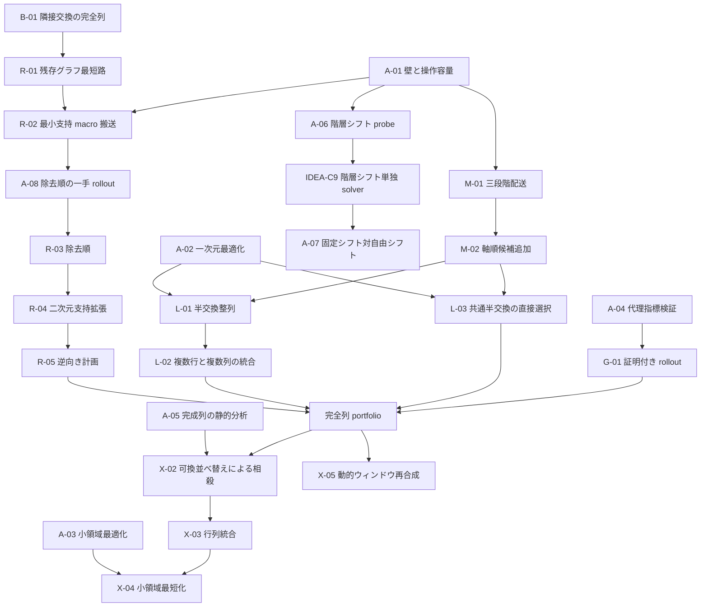

# AHC068 実験ロードマップ

## 文書の役割

この文書は、`notes/deep/claude_initial_plan.md` にある初期案と、`v001_baseline` の結果を照合して作った実験順の詳細メモである。
初期案は発想の履歴として変更せず、この文書で依存関係、事前に潰す問い、各実験の最小差分、採否条件を管理する。

実験アイデアの状態は `notes/backlog.md`、実験の事前登録と結果は `notes/journal.md`、証明済みの性質は `notes/important_properties.md` を正本とする。
この文書には、個々の評価結果を追記して正史を重複させない。

## 現在地

`v004_differential_beam`を現行の採用基準とする。
固定全域木の葉を保護確定する完全遷移へ差分更新ビームを載せ、tools/inの全ケースをfallbackなしで完成した。
同一候補生成・同一評価の幅1に対して平均`T`を9.908%短縮したため、複数の葉確定順を保持する効果は確認できた。
差分更新、評価式、固定全域木、候補遷移の個別寄与は分離できていないため、次は`A-08`で評価proxyを較正する。
詳細は`notes/deep/v004_retrospective.md`を参照する。

`v006_wallless_row_staging`は全体方式として棄却されたが、壁なし9ケースではv004より短いため条件付き候補として残る。
`v007_bidirectional_macro`と`v008_chokudai_treedist`は実験中であり、木・方向・木距離評価に触れる次案は両者の判定後に着手する。
既存初期案の予想操作数は実測前の仮説としてのみ扱い、採否には同じ入力に対して得た完全列の操作数と公式得点を使う。

## 得点目標

運用上の評価目標は、1ケース平均`6,890,000`点である。
完成時の得点式から、この目標には操作数の幾何平均を約`843.38`以下にする必要がある。
v004の平均得点5,483,797は目標の79.59%であり、同じ換算による幾何平均`T`は約2,235である。
約190手は個別入力の下界ではないため、長期的な尺度に限って使う。
各実験の採否基準は機構の寄与を判定できる値に固定し、最終目標との差を併記する。

## 完成に対する方針

各 solver は、中心アルゴリズム自身が完成配置へ到達することを目指す。
別方式の完全 tail、失敗時だけ使う完成保証、完成列 portfolio は接続しない。
完成できない場合は、そのアルゴリズムまたは詰めの不足として最終 `E` と停滞位置を報告する。

## 初期案から修正した前提

### 一般の二枚交換

「任意の二枚交換を常に三操作で実現できる」は証明されていない。
対合 `g` と隣接交換 `s` による `g s g` が目的の二枚交換になるには、`g` が交換対象二枚を `s` の両端へ同時に写す必要がある。
一回の合法長方形操作でその条件を満たせる保証はないため、終盤ソルバの三手見積もりは小規模全探索または構成証明を通すまで使わない。

### 長距離半交換

一枚移動グラフ上の最短路は、注目カードの現在の搬送だけを見れば隣接搬送以下になる。
しかし、巻き添えになった他カードが将来の搬送を悪化させるため、完成までの総操作数について隣接版を必ず上回るわけではない。
macro 版は初期状態から独立した完全列を生成し、隣接版との短い方を選ぶ。

### 壁の効果

壁生成は既存壁網へ枝を一点接続するため、新しい閉路を作らない。
壁の効果は「部屋数」だけでは捉えず、一枚移動距離、壁越し仮想交換の迂回費用、合法長方形の面積と本数に分けて測る。

### 約 190 手の目安

42,000 個の候補操作と `400!` 個の順列から得る約 190 手は、全順列を覆うための計数上の目安である。
特定入力の最適手数下界ではないため、実験の採否判定には使わない。

## 解法の依存関係

`portfolio` は失敗時だけ発火する保険分岐ではない。
複数の正常な完全計画を毎ケース構成し、その操作数を比較して最短列を出す通常経路である。

## 共通評価規約

### 正当性 gate

すべての solver 実験は、次の条件を一つでも満たさなければ棄却または実装不備扱いとする。

- 出力した全操作が合法である。
- 最終状態で `E=0` になる。
- `T\le10^5` である。
- 内部状態と出力列の再生結果が一致する。
- 最大実行時間に事前登録した余裕がある。

### 主評価量

全ケースが完成した方式同士は、公式得点と `log_2 T` の平均を主指標にする。
`log_2 T` の平均低下は、操作数の幾何平均低下に等しい。

通常の独立実験は、凍結した検証集合で幾何平均操作数を 0.5% 以上削減し、ケースごとの対数改善量の片側 95% 区間が正なら採用候補とする。
基準完全列との比較によってケースごとの非悪化を保証する変更は、複雑性が小さければ 0.2% 以上の削減を採用候補とする。

### データ分層

生成時の `W` は入力に含まれないため、入力から計算できる次の特徴で層別する。

- 内部壁辺数
- 合法操作数を 42,000 で割った値
- 最大合法長方形面積
- 一枚移動グラフの平均距離と直径
- 壁で隔てられた幾何隣接マスの迂回費用
- 初期配置から目標までのグラフ距離総和
- 初期配置のサイクル数

主報告は、macro の豊富さを低、中、高、初期輸送距離を低、中、高に分けた 3×3 表とする。
壁越し迂回費用の上位層は別の stress 層として報告する。

## 方針を選ぶための事前分析

`A-01`、`A-02`、`A-03`、`A-05` は、contest の解答列を生成せず統計または小盤面だけを扱う補助分析として設計する。
`A-04` と `A-08` は完全計画を内部生成し、`A-06` と `A-07` は解答列を直接生成するため、solution program と同じ運用にする。
実装前に journal へ事前登録し、一度実行したら結果を報告してユーザーの新しい指示を待つ。

### A-01 壁と操作容量

- 対応する問い：`Q-C3`
- 仮説：壁は一枚移動距離よりも、大面積長方形による一括実行能力を強く悪化させる。
- 測定：合法操作数の形状別分布、最大面積、マスごとの一枚移動次数、平均一枚移動距離、壁越し仮想隣接交換の `2d-1` 費用、極大壁なし長方形。
- 判断：一枚移動距離が短く保たれるなら `R-02` を優先し、大面積長方形も多い層があるなら `R-04` と `M-01` を進める。

### A-02 一次元半交換の厳密距離

- 対応する問い：`Q-C5`
- 仮説：長さ 20 の一次元順列は、隣接交換より少ない等長ブロック交換で整列できる。
- 測定：小さい長さの全状態 BFS による最適手数、反転数、ブレークポイント数、サイクル数との相関、各代理指標で選んだ手の最適手 recall。
- 判断：隣接交換比の短縮が安定して大きい場合だけ `L-01` を実装する。

### A-03 小領域の厳密最適化

- 対応するアイデア：`IDEA-C6`
- 仮説：小さい壁なし領域には、一般的な完全計画より短い局所置換パターンが頻出する。
- 測定：`2×4`、`3×3` などの全状態最短距離、一般の二枚交換と三サイクルの最短手数、壁で候補操作を減らした場合の可到達状態。
- 判断：一般の二枚交換三手という既存仮説は、この分析で成立条件が確定した場合だけ使う。

### A-04 代理指標と rollout gain

- 対応する問い：`Q-C2`
- 対応するアイデア：`IDEA-C3`、`IDEA-C5`、`IDEA-C7`
- 運用：完全計画を内部生成するため、solver 実験として事前登録する。
- 仮説：安価な代理指標の上位候補に、完全計画長を実際に減らす長方形が高確率で含まれる。
- 測定：距離総和、サイクル数、正解マス数、行列需要、基準列との一致数について、真の最良 gain が上位 `K` 件に入る割合と順位相関。
- 判断：top-`K` recall が 90% 未満、または順位相関が非正なら、その代理指標を `G-01` に使わない。

### A-05 基準完全列の静的分析

- 対応する問い：`Q-D3`
- 仮説：`v001_baseline` の隣接交換列には、可換な操作の並べ替え、同じ列境界の交換統合、等長ブロック交換への置換余地がある。
- 測定：連続同一操作、互いに素な操作間の依存関係、統合可能な連続行数と連続列数、半交換と等価な部分列数。
- 判断：連続する同一操作は正規化で無条件に除去し、それ以外の機会が少なければ `X` 系列を後回しにする。

### A-06 階層シフトの機構確認

- 対応する問い：`Q-C7`、`Q-C8`
- 対応するアイデア：`IDEA-C9`
- 運用：階層シフト列を解答として直接生成するため、solver 実験として事前登録する。
- 仮説：シフト量を `10,5,3,2,1` の順に固定すると同じ移動量を必要とするカードが増え、一操作当たりの有効移動枚数が自由シフト貪欲より増える。
- 測定：ステージ別の操作数、正方向へ動いたカード数、逆方向へ動いたカード数、最大益が正でなくなった回数、ステージ前後の範囲外枚数、最終 `E`。
- 判断：完全 tail は接続せず、階層シフト自身が全ケースを完成させるかと、完成時の実操作数・公式得点で判定する。

最初の probe では、シフト系列、軸順、評価、停滞処理を同時に変えない。
第零候補を `10,5,3,2,1`、各 `L` 内の V→H 反復、範囲外枚数の純減として固定し、二手整地も入れない。

### A-07 固定シフト対自由シフトの対照実験

- 対応する問い：`Q-D6`
- 対応するアイデア：`IDEA-D14`
- 運用：進行中の `A-06` は変更せず、その判定後に別の solver 実験として事前登録する。
- 仮説：シフト量を `10,5,3,2,1` に固定する階層化は、毎手 `L∈1..10` から最大益を選ぶ自由シフト貪欲より、需要を同質化して完遂率または完成時の総 `T` を改善する。
- 変更：`A-06` と同じ評価関数、軸順、停止則を保ち、シフト量の選択だけを自由化する。
- 機構確認：固定版と自由版の完遂ケース数、シフト量別の操作数、実効並列度、停滞時の最終 `E`、共通完遂ケースの総 `T`。
- 採否基準：完遂ケース数を主指標とし、同数なら共通完遂ケースの幾何平均 `T` が 0.5% 以上短い方式を次の探索候補生成へ採用する。

### A-08 除去順の一手 rollout

- 対応する問い：`Q-D9`
- 対応するアイデア：`IDEA-D17`
- 運用：候補ごとに完全計画を内部生成するため、solver 実験として事前登録する。
- 仮説：v004の葉確定候補を一つ選んだ後の完成長は、現行の`10*T+木距離和`より、即時搬送距離、残存合法区間数、最大jump長のいずれかを含むproxyで正確に予測できる。
- 変更：v004の状態表現、固定全域木、保護確定遷移、幅1完成器を固定し、深さ0、50、100、200、300で各葉候補を一つ選んだ後に同じ完成器で最後まで完成させる。
- 機構確認：proxyごとのtop-4とtop-8 recall、基準完成長とのSpearman順位相関、候補評価時間、深さ帯・壁容量層ごとの指標。
- 採否基準：top-8 recallが90%以上かつ順位相関が正のproxyだけを次の除去順評価に採用し、現行評価が未達なら探索方式を変えず評価式だけを差し替える。

## 完成保証を改善する実験

### R-01 残存グラフ最短路

- 仮説：葉の確定順を変えず、全域木上の経路を残存開辺グラフの最短路へ置き換えるだけで操作数が減る。
- 変更：`v001_baseline` から搬送経路だけを変更する。
- 機構確認：木上距離、残存グラフ距離、実際の swap 数、確定済みマスへの接触回数。
- 採否基準：正当性 gate を通過し、`v001_baseline` 比で幾何平均操作数を 0.5% 以上削減する。

### R-02 最小支持 macro 搬送

- 仮説：同じ葉確定順のまま、一行または一列の半交換で作る一枚移動グラフを使うと完全列が短くなる。
- 変更：`R-01` から搬送グラフだけを変更し、横は高さ 1、縦は幅 1 の最小支持操作だけを使う。
- 機構確認：移動距離 2 以上の操作数、隣接距離に対する macro 距離比、カード一枚当たりの搬送手数、79,800 手上界の維持。
- 採否基準：正当性 gate を通過し、`R-01` 比で幾何平均操作数を 0.5% 以上削減する。

`R-02` が現在の一枚搬送を短くしても、将来の巻き添えによって総手数が増える場合がある。
`R-01` と `R-02` の完全列を別々に生成し、短い方を出す比較も記録する。

### R-03 除去順

除去順は一実験につき一種類だけ追加する。

#### R-03a 近い非関節点

- 仮説：除去後も連結な目的マスのうち、正解カードの macro 距離が短いものを優先すると総搬送手数が減る。
- 変更：`R-02` から除去頂点の選択だけを変更する。
- 機構確認：候補数、選択距離、残存グラフの関節点数、後半の平均 macro 距離。
- 採否基準：`R-02` 比で幾何平均操作数を 0.5% 以上削減する。

#### R-03b 操作容量を残す除去順

- 仮説：即時搬送距離より、除去後の合法一次元区間数を優先すると後半の macro 能力が残り、総手数が減る。
- 変更：`R-03a` から除去頂点の評価だけを変更する。
- 機構確認：残存合法区間数、最大 jump 長、未確定集合の穴数、前半と後半の搬送手数。
- 採否基準：`R-03a` 比で幾何平均操作数を 0.5% 以上削減し、macro が少ない層を 1% 以上悪化させない。

### R-04 二次元支持拡張

- 仮説：注目カードの移動先を変えずに支持長方形を直交方向へ拡張し、他カードの距離も減らすと総操作数が減る。
- 変更：採用済み `R-03` から、同じ一枚移動辺に対する支持長方形の選択だけを変更し、支持全体が現在の未確定集合に含まれる候補だけを使う。
- 機構確認：最小支持以外の採用回数、平均拡張幅、同時に距離が減ったカード数、同時に正解位置へ来たカード数、確定済みマスとの交差回数が零であること。
- 採否基準：採用機構が実際に発火し、採用済み `R-03` 比で幾何平均操作数を 0.5% 以上削減する。

### R-05 逆向き計画

- 仮説：目標配置から初期配置へ同じ単調固定法を適用し、操作列を逆順にすると、貪欲判断の非対称性から短い完全列が得られるケースがある。
- 変更：採用済み `R-04` の計画方向だけを追加する。
- 機構確認：前向きと逆向きの各計画長、逆向きが選ばれたケース率、壁特徴別の選択率。
- 採否基準：ケースごとの短い方を選んで非悪化を保証し、全体で 0.2% 以上削減する。

## 三段階配送と一次元整列

### M-01 横、縦、横の三段階配送

- 仮説：二部多重グラフの完全マッチング分解に基づく三段階配送は、壁迂回を含めても一部のケースで単調固定法より短い。
- 変更：既存 solver を変えず、新しい完全計画生成器を候補へ追加する。
- 機構確認：各色が完全マッチングであること、第一段階後の中間列、第二段階後の目標行、第三段階後の `E=0`、壁越し交換の中間カード復元、迂回費用の内訳。
- 採否基準：基準完全列との短い方を選んで正当性 gate を通過し、全体で 0.5% 以上削減する。

### M-02 縦、横、縦の候補追加

- 仮説：壁の方向によって横、縦、横と縦、横、縦の迂回費用が異なるため、両方を作ると短縮できる。
- 変更：`M-01` に対称な計画方向だけを追加する。
- 機構確認：各方向の計画長、選択率、縦壁量と横壁量による選択率の差。
- 採否基準：ケースごとの非悪化を保証し、`M-01` 比で 0.2% 以上削減する。

### L-01 一次元半交換整列

- 前提：`A-02` で隣接交換に対する短縮余地が確認されている。
- 仮説：三段階配送中の各行と各列を、隣接交換ではなく等長ブロック交換で整列すると計画長が減る。
- 変更：`M-02` の一次元整列器だけを変更する。
- 機構確認：一列当たりの操作数、平均半交換長、隣接交換列からの純削減数、各一次元順列の完成確認。
- 採否基準：`M-02` 比で幾何平均操作数を 0.5% 以上削減する。

### L-02 複数行と複数列の統合

- 仮説：隣接する複数行または複数列が同じ区間の半交換を必要とするとき、一つの二次元長方形へまとめられる。
- 変更：`L-01` の操作スケジュールと統合だけを変更する。
- 機構確認：統合前後の誘導置換一致、平均統合本数、壁による統合失敗数。
- 採否基準：ケースごとの非悪化を保証し、`L-01` 比で 0.2% 以上削減する。

### L-03 共通半交換の直接選択

- 前提：`A-02` で長さ 20 の一次元状態を比較できる距離または評価量が得られている。
- 対応する問い：`Q-D7`
- 対応するアイデア：`IDEA-D15`
- 仮説：各行または各列を独立に整列してから一致操作を統合するより、複数行または複数列の総改善量が最大になる共通区間を直接選ぶ方が、一操作当たりの処理枚数を増やせる。
- 変更：`M-02` の各配送段階で、独立な一次元整列器を、合法な共通半交換の総改善量を最大化する貪欲整列器へ置き換える。
- 機構確認：一操作で同時に改善した行数または列数、平均支持幅、一次元評価量の純減、壁による候補分断、各配送段階と最終状態の完成確認。
- 採否基準：正当性 gate を通過し、`L-02` 比で幾何平均操作数を 0.5% 以上削減する。

## 大域改善と等価圧縮

### G-01 完全計画長で利益を証明する rollout

- 前提：`A-04` で top-`K` 候補の recall が基準を満たしている。
- 仮説：完全計画の前に一回だけ一般長方形を入れ、変更後の完全計画を作り直すと、総操作数を厳密に減らせる候補がある。
- 変更：採用済み portfolio の前段に、利益が正と確認できた一手だけを追加する。
- 機構確認：各候補の代理評価、正確な純削減数、候補評価時間、採用長方形の形状。
- 採否基準：採用手すべてで `1 + 変更後完全計画長 < 変更前完全計画長` を満たし、全体で 0.5% 以上削減する。

### G-02 複数手 rollout または beam

- 前提：`G-01` で正の利益を持つ一手が十分なケースに存在する。
- 仮説：数手先まで見ると、一手では利益が出ないが複数手で短縮する操作列を見つけられる。
- 変更：`G-01` から探索深さだけを増やす。
- 機構確認：深さ別の改善数、重複状態数、完全計画長の下がり方、候補評価時間。
- 採否基準：`G-01` 比で 0.5% 以上削減し、実行時間 gate を通過する。

### X-02 可換操作の並べ替えによる相殺

- 前提：`A-05` で、互いに素な操作を越えて相殺できる同一操作が確認されている。
- 仮説：支持が互いに素な操作を並べ替えると同一操作対を隣接させ、対合性により二操作を削除できる。
- 変更：採用済み完全列へ、互いに素な操作の並べ替えと、並べ替えで隣接した同一操作対の削除だけを追加する。
- 機構確認：並べ替え数、新たに露出した相殺対数、圧縮前後の誘導置換一致。
- 採否基準：ケースごとの非悪化と正当性を保証し、採用済み完全列比で 0.2% 以上削減する。

### X-03 隣接行と隣接列の統合

- 前提：`A-05` で同じ区間操作が隣接行または隣接列に並ぶことが確認されている。
- 仮説：独立な一次元操作を合法な二次元長方形一回へ置き換えると、誘導置換を変えずに短縮できる。
- 変更：`X-02` から、隣接行と隣接列の統合だけを追加する。
- 機構確認：統合数、平均統合本数、壁による統合失敗数、圧縮前後の誘導置換一致。
- 採否基準：ケースごとの非悪化と正当性を保証し、`X-02` 比で 0.2% 以上削減する。

### X-04 小領域最短列への置換

- 前提：`A-03` で局所最適表の短縮余地が確認されている。
- 仮説：小領域内だけに支持を持つ部分列を、同じ誘導置換の最短列へ置き換えると短縮できる。
- 変更：`X-03` から、小領域表による置換だけを追加する。
- 機構確認：置換箇所数、領域形状別の削減数、圧縮前後の誘導置換一致、表引き時間。
- 採否基準：ケースごとの非悪化と正当性を保証し、`X-03` 比で 0.2% 以上削減する。

### X-05 完成列の動的ウィンドウ再合成

- 対応する問い：`Q-D8`
- 対応するアイデア：`IDEA-D16`
- 仮説：固定小領域の表引きでは捉えられない連続部分列にも、同じ誘導置換を実現する短い合法操作列が存在する。
- 変更：採用済み完全列から影響マス数が上限以下の連続ウィンドウを列挙し、各ウィンドウの誘導置換を BFS、双方向探索、IDA*、小ビームのうち事前登録した一方式で再合成する。
- 機構確認：探索したウィンドウ数、影響マス数、短縮に成功した区間数、区間ごとの削減手数、置換前後の誘導置換一致、圧縮時間。
- 採否基準：置換は短い等価列が見つかった場合だけ行い、正当性 gate と実行時間 gate を通過した上で、採用済み完全列比で幾何平均操作数を 0.2% 以上削減する。

## 条件付きの研究枝

### IDEA-C9 階層シフトステージ

`IDEA-C9` は、`IDEA-C4` の自由な需要被覆を、シフト量の大きい段階から小さい段階へ制限した具体案である。
固定シフト量と加法的なペア評価を与えた一手の最大化は、壁で区切った列区間上の最大部分配列問題へ落とせる。

一方、各カードの行差と列差を符号付きシフト量の和で表現できることは、盤面全体で相手カードを同時に選べることを保証しない。
この不足も方式の性能として測るため、最初の実験では別方式による完成保証を接続しない。

- 仮説：固定ステージ列の貪欲だけで全ケースを完成させ、同時移動によって二桁の幾何平均操作数へ到達できる。
- 変更：`A-06` で固定した一種類のステージ列を単独 solver として実装する。
- 機構確認：ステージ別実効並列度、壁による候補分断、停滞回数、最終 `E`、完成ケースの `T`。
- 採否基準：tools/in の全ケースを完成させ、平均得点6,890,000以上を達成する。

`notes/deep/claude_hierarchical_stages.md` にある推定 `T` と一般二枚交換三手の終盤見積もりは、初期仮説としてのみ保持する。
採否には使わない。

### IDEA-C2 行ステージング

`IDEA-C2` は、`R-02` の単カード確定と `M-01` の行単位配送の中間にある独立枝として残す。
横幅 20 の操作が壁で失敗する頻度と、分割後の行当たり操作数を `A-01` で見積もってから着手する。

### IDEA-C4 需要被覆

`IDEA-C4` は、`A-01` で実効並列度が高く、`A-04` で需要減少が完全計画長の減少を予測できる場合に `G-01` の候補生成へ組み込む。
需要被覆だけを先に長く実行する実験は、完全計画との一手 rollout を通した後に行う。

### IDEA-C6 終盤専用ソルバ

`IDEA-C6` は、`A-03` で一般二枚交換と三サイクルの成立条件を確定してから着手する。
未証明の三手交換を完成保証に使わない。

### W-01 壁なし領域と portal

壁なし領域間で交換すべきカードを壁端付近へ集め、一括交換する枝である。
`A-01` で portal 当たりの輸送需要と合法長方形容量を測り、packing 費用を上回る余地がある場合だけ実験へ進める。

### IDEA-C8 再帰ブロック分割

対応位置しか交換できない制約と壁への弱さがあるため、他系列が停止条件に達した場合の再検討候補とする。
（優先度を下げる理由: 任意のカードを望む子領域へ振り分ける構成がなく、小盤面でも完全性を示す根拠がない。）

## 横断的な実装基盤

`IDEA-D1` の合法操作カタログ、密なカード位置配列、操作支持 bitset、差分 `apply` と `undo` は、`R-02`、`R-04`、`G-01`、`X` 系列の共通前提になる。
ただし、共通基盤を solver 実験と同時に大きく変更すると効果を分離できないため、機構だけを検証する補助実装として先に整える。

`v000_template.rs` へ共通化する場合は、AGENTS.md に従って更新内容を説明し、ユーザーの許可を得てから変更する。

## 停止条件

- 合法性、`E=0`、操作上限のいずれかを一件でも破った系列は、その時点で停止する。
- 機構確認が発火していない場合は効果を判定せず、実装不備または入力条件不成立として報告する。
- 代理指標の top-`K` recall が 90% 未満、または真の gain との順位相関が非正なら、その代理指標系列を停止する。
- 同じ系列で二実験続けて幾何平均改善が 0.2% 未満なら、次の派生実験へ進まない。
- 特定の入力層だけ 1% 以上悪化する方式は全体採用せず、入力だけから判定できる条件付き portfolio として再設計する。
- 領域分解と大域 beam は、対応する補助分析の gate を満たすまで実装しない。

## 実行ルール

一回の solver 実験では中心アイデアを一つだけ変更する。
実装前に `notes/journal.md` へ仮説、変更、機構確認、採否基準を事前登録する。

solver を機構確認または評価で一度でも実行した後は、結果と事前登録基準への機械的な照合だけを報告する。
その結果に基づく採否判断、コード変更、次実験、再実行は、ユーザーの新しい明示指示を待ってから行う。

## 推奨着手順

1. 実験中の`v007`と`v008`を判定し、木・方向と木距離評価の寄与を確定する。
2. `A-08 / IDEA-D17`でv004の除去順proxyを較正する。
3. 現行評価がgate未達なら、v004の探索・候補・遷移を保って評価式だけを差し替える。
4. 現行評価がgateを通り、v007で木依存が大きければ、固定木の葉制限だけを`R-03a`または`R-03b`へ広げる。
5. 現行評価がgateを通り、反復幅拡大の再開コストが支配的なら、`IDEA-D19`で探索スケジュールだけをchokudaiへ変える。
6. 除去順が安定した後に`R-04 / IDEA-D5`で二次元支持を追加し、他カードとの同時改善を測る。
7. 完全計画の質が上がった後に静的圧縮と`X-05`を順に試す。
