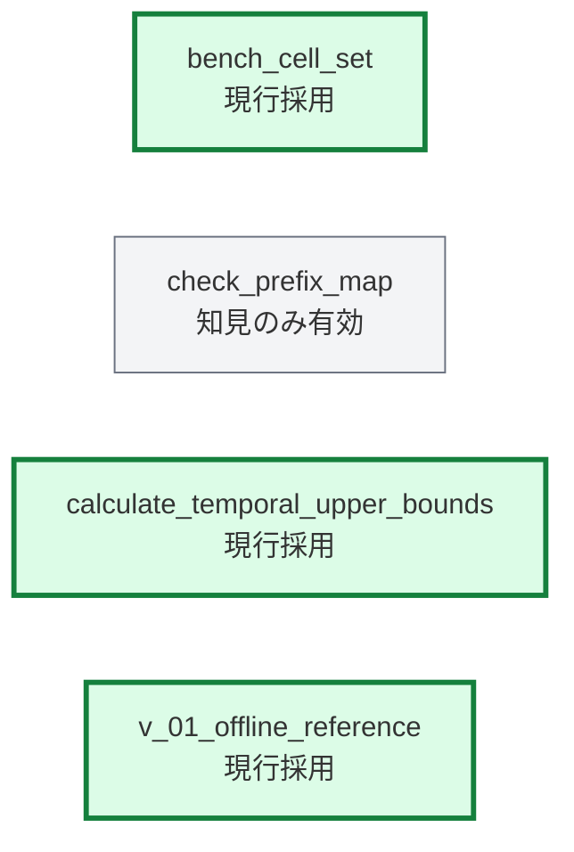

# 実験DAG

このファイルは `notes/journal.md` から自動生成する。
手作業では編集せず、`generate_experiment_dag` の `--write` モードで更新する。

solid矢印は実装上の基盤となる `base`、破線矢印は別実験から中心機構を取り込む `imports` を表す。
ノードの色は現在状態を表し、評価時点の採否は `notes/journal.md` の「当時の判定」で確認する。

## 現行系統

現行採用または後続への統合に分類した実験だけを表示する。

```mermaid
flowchart LR
  v501_pro_shadow_packing["v501_pro_shadow_packing<br/>後続への統合"]
  v005_shape_diversity["v005_shape_diversity<br/>後続への統合"]
  v005_move_rescue["v005_move_rescue<br/>後続への統合"]
  v006_shape_move_combo["v006_shape_move_combo<br/>後続への統合"]
  v007_plan_quality["v007_plan_quality<br/>後続への統合"]
  v008_flexible_escape["v008_flexible_escape<br/>後続への統合"]
  v010_budget_retune["v010_budget_retune<br/>後続への統合"]
  v012_rollout_choice["v012_rollout_choice<br/>後続への統合"]
  v014_greedy_growth["v014_greedy_growth<br/>後続への統合"]
  v017_normal_rollout["v017_normal_rollout<br/>後続への統合"]
  v035_no_move_growth_cutloss["v035_no_move_growth_cutloss<br/>後続への統合"]
  v040_no_move_biased_swap["v040_no_move_biased_swap<br/>後続への統合"]
  v047_no_move_strong_biased["v047_no_move_strong_biased<br/>後続への統合"]
  v050_move_strong_biased["v050_move_strong_biased<br/>後続への統合"]
  v053_posterior_rollout["v053_posterior_rollout<br/>後続への統合"]
  bench_cell_set["bench_cell_set<br/>現行採用"]
  v069_adaptive_time_budget["v069_adaptive_time_budget<br/>後続への統合"]
  v071_articulation_growth["v071_articulation_growth<br/>現行採用"]
  calculate_temporal_upper_bounds["calculate_temporal_upper_bounds<br/>現行採用"]
  v_01_offline_reference["v_01_offline_reference<br/>現行採用"]
  v501_pro_shadow_packing -->|base| v005_shape_diversity
  v501_pro_shadow_packing -->|base| v005_move_rescue
  v005_move_rescue -->|base| v006_shape_move_combo
  v005_shape_diversity -.->|imports| v006_shape_move_combo
  v006_shape_move_combo -->|base| v007_plan_quality
  v007_plan_quality -->|base| v008_flexible_escape
  v008_flexible_escape -->|base| v010_budget_retune
  v010_budget_retune -->|base| v012_rollout_choice
  v012_rollout_choice -->|base| v014_greedy_growth
  v014_greedy_growth -->|base| v017_normal_rollout
  v035_no_move_growth_cutloss -->|base| v040_no_move_biased_swap
  v040_no_move_biased_swap -.->|imports| v047_no_move_strong_biased
  v017_normal_rollout -->|base| v050_move_strong_biased
  v047_no_move_strong_biased -.->|imports| v050_move_strong_biased
  v050_move_strong_biased -->|base| v053_posterior_rollout
  v053_posterior_rollout -->|base| v069_adaptive_time_budget
  v069_adaptive_time_budget -->|base| v071_articulation_growth
  v035_no_move_growth_cutloss -.->|imports| v071_articulation_growth
  classDef current fill:#dcfce7,stroke:#15803d,stroke-width:3px;
  classDef integrated fill:#dbeafe,stroke:#2563eb,stroke-width:2px;
  classDef knowledge fill:#f3f4f6,stroke:#6b7280;
  classDef conditional fill:#fef3c7,stroke:#d97706,stroke-width:2px;
  classDef unresolved fill:#ffedd5,stroke:#ea580c,stroke-width:2px;
  classDef external fill:#ffffff,stroke:#9ca3af,stroke-dasharray: 4 3;
  class bench_cell_set,v071_articulation_growth,calculate_temporal_upper_bounds,v_01_offline_reference current;
  class v501_pro_shadow_packing,v005_shape_diversity,v005_move_rescue,v006_shape_move_combo,v007_plan_quality,v008_flexible_escape,v010_budget_retune,v012_rollout_choice,v014_greedy_growth,v017_normal_rollout,v035_no_move_growth_cutloss,v040_no_move_biased_swap,v047_no_move_strong_biased,v050_move_strong_biased,v053_posterior_rollout,v069_adaptive_time_budget integrated;
```

## 現在状態の件数

| 現在状態 | 件数 |
|---|---:|
| 現行採用 | 4 |
| 後続への統合 | 16 |
| 知見のみ有効 | 28 |
| 条件付き再検討 | 23 |
| 未決着 | 26 |

## 初期および主力形成系列

```mermaid
flowchart LR
  v001_theory_admission["v001_theory_admission<br/>知見のみ有効"]
  v002_temporal_packing["v002_temporal_packing<br/>知見のみ有効"]
  v501_pro_shadow_packing["v501_pro_shadow_packing<br/>後続への統合"]
  v003_perimeter_slack["v003_perimeter_slack<br/>知見のみ有効"]
  v004_component_aware_choice["v004_component_aware_choice<br/>条件付き再検討"]
  v005_shape_diversity["v005_shape_diversity<br/>後続への統合"]
  v005_move_rescue["v005_move_rescue<br/>後続への統合"]
  v006_shape_move_combo["v006_shape_move_combo<br/>後続への統合"]
  v007_plan_quality["v007_plan_quality<br/>後続への統合"]
  v008_flexible_escape["v008_flexible_escape<br/>後続への統合"]
  v009_wider_blockers["v009_wider_blockers<br/>条件付き再検討"]
  v010_budget_retune["v010_budget_retune<br/>後続への統合"]
  v011_deep_levels["v011_deep_levels<br/>知見のみ有効"]
  v012_rollout_choice["v012_rollout_choice<br/>後続への統合"]
  v013_departure_field["v013_departure_field<br/>条件付き再検討"]
  v014_greedy_growth["v014_greedy_growth<br/>後続への統合"]
  v015_quick_repack["v015_quick_repack<br/>条件付き再検討"]
  v016_low_r_slack2["v016_low_r_slack2<br/>条件付き再検討"]
  v017_normal_rollout["v017_normal_rollout<br/>後続への統合"]
  v001_theory_admission -->|base| v002_temporal_packing
  v002_temporal_packing -->|base| v003_perimeter_slack
  v501_pro_shadow_packing -->|base| v004_component_aware_choice
  v501_pro_shadow_packing -->|base| v005_shape_diversity
  v501_pro_shadow_packing -->|base| v005_move_rescue
  v005_move_rescue -->|base| v006_shape_move_combo
  v005_shape_diversity -.->|imports| v006_shape_move_combo
  v006_shape_move_combo -->|base| v007_plan_quality
  v007_plan_quality -->|base| v008_flexible_escape
  v008_flexible_escape -->|base| v009_wider_blockers
  v008_flexible_escape -->|base| v010_budget_retune
  v010_budget_retune -->|base| v011_deep_levels
  v010_budget_retune -->|base| v012_rollout_choice
  v012_rollout_choice -->|base| v013_departure_field
  v012_rollout_choice -->|base| v014_greedy_growth
  v014_greedy_growth -->|base| v015_quick_repack
  v014_greedy_growth -->|base| v016_low_r_slack2
  v014_greedy_growth -->|base| v017_normal_rollout
  classDef current fill:#dcfce7,stroke:#15803d,stroke-width:3px;
  classDef integrated fill:#dbeafe,stroke:#2563eb,stroke-width:2px;
  classDef knowledge fill:#f3f4f6,stroke:#6b7280;
  classDef conditional fill:#fef3c7,stroke:#d97706,stroke-width:2px;
  classDef unresolved fill:#ffedd5,stroke:#ea580c,stroke-width:2px;
  classDef external fill:#ffffff,stroke:#9ca3af,stroke-dasharray: 4 3;
  class v501_pro_shadow_packing,v005_shape_diversity,v005_move_rescue,v006_shape_move_combo,v007_plan_quality,v008_flexible_escape,v010_budget_retune,v012_rollout_choice,v014_greedy_growth,v017_normal_rollout integrated;
  class v001_theory_admission,v002_temporal_packing,v003_perimeter_slack,v011_deep_levels knowledge;
  class v004_component_aware_choice,v009_wider_blockers,v013_departure_field,v015_quick_repack,v016_low_r_slack2 conditional;
```

## 再移動なし系列

```mermaid
flowchart LR
  v018_no_move_boundary["v018_no_move_boundary<br/>条件付き再検討"]
  v019_no_move_growth_sa["v019_no_move_growth_sa<br/>条件付き再検討"]
  v020_no_move_growth_rollout["v020_no_move_growth_rollout<br/>条件付き再検討"]
  v021_no_move_departure_affinity["v021_no_move_departure_affinity<br/>知見のみ有効"]
  v022_no_move_growth_lns["v022_no_move_growth_lns<br/>条件付き再検討"]
  v023_no_move_slot_calendar["v023_no_move_slot_calendar<br/>条件付き再検討"]
  v024_no_move_capacity_reserve["v024_no_move_capacity_reserve<br/>知見のみ有効"]
  v025_no_move_growth_slot["v025_no_move_growth_slot<br/>条件付き再検討"]
  v026_no_move_medium_slots["v026_no_move_medium_slots<br/>知見のみ有効"]
  v027_no_move_slot_veto["v027_no_move_slot_veto<br/>知見のみ有効"]
  v028_no_move_compact_inventory["v028_no_move_compact_inventory<br/>知見のみ有効"]
  v029_no_move_box_growth["v029_no_move_box_growth<br/>知見のみ有効"]
  v030_no_move_future_fit["v030_no_move_future_fit<br/>知見のみ有効"]
  v031_no_move_future_components["v031_no_move_future_components<br/>知見のみ有効"]
  v032_no_move_cross_perimeter["v032_no_move_cross_perimeter<br/>知見のみ有効"]
  v033_no_move_box_beam["v033_no_move_box_beam<br/>知見のみ有効"]
  v034_no_move_growth_topology["v034_no_move_growth_topology<br/>条件付き再検討"]
  v035_no_move_growth_cutloss["v035_no_move_growth_cutloss<br/>後続への統合"]
  v036_no_move_reservation_price["v036_no_move_reservation_price<br/>条件付き再検討"]
  v037_no_move_prefix_theta["v037_no_move_prefix_theta<br/>知見のみ有効"]
  v038_no_move_prefix_reserve["v038_no_move_prefix_reserve<br/>知見のみ有効"]
  v039_no_move_temporal_cutloss["v039_no_move_temporal_cutloss<br/>条件付き再検討"]
  v040_no_move_biased_swap["v040_no_move_biased_swap<br/>後続への統合"]
  v041_no_move_swap_rollout["v041_no_move_swap_rollout<br/>知見のみ有効"]
  v042_no_move_admission_rollout["v042_no_move_admission_rollout<br/>条件付き再検討"]
  v043_no_move_causal_veto["v043_no_move_causal_veto<br/>知見のみ有効"]
  v044_no_move_veto_biased["v044_no_move_veto_biased<br/>知見のみ有効"]
  v045_no_move_geometry_veto["v045_no_move_geometry_veto<br/>知見のみ有効"]
  v046_no_move_deep_biased["v046_no_move_deep_biased<br/>知見のみ有効"]
  v047_no_move_strong_biased["v047_no_move_strong_biased<br/>後続への統合"]
  v048_no_move_release_atlas["v048_no_move_release_atlas<br/>条件付き再検討"]
  v049_no_move_room_pareto["v049_no_move_room_pareto<br/>知見のみ有効"]
  v062_no_move_deadline_shelves["v062_no_move_deadline_shelves<br/>知見のみ有効"]
  v063_no_move_size_gradient["v063_no_move_size_gradient<br/>未決着"]
  v064_no_move_contact_sync["v064_no_move_contact_sync<br/>未決着"]
  v065_no_move_canonical_rollout["v065_no_move_canonical_rollout<br/>未決着"]
  v017_normal_rollout["v017_normal_rollout<br/>別系列参照"]
  v017_normal_rollout -->|base| v018_no_move_boundary
  v018_no_move_boundary -->|base| v019_no_move_growth_sa
  v019_no_move_growth_sa -->|base| v020_no_move_growth_rollout
  v019_no_move_growth_sa -->|base| v021_no_move_departure_affinity
  v019_no_move_growth_sa -->|base| v022_no_move_growth_lns
  v022_no_move_growth_lns -->|base| v023_no_move_slot_calendar
  v023_no_move_slot_calendar -->|base| v024_no_move_capacity_reserve
  v024_no_move_capacity_reserve -->|base| v025_no_move_growth_slot
  v024_no_move_capacity_reserve -->|base| v026_no_move_medium_slots
  v024_no_move_capacity_reserve -->|base| v027_no_move_slot_veto
  v024_no_move_capacity_reserve -->|base| v028_no_move_compact_inventory
  v024_no_move_capacity_reserve -->|base| v029_no_move_box_growth
  v029_no_move_box_growth -->|base| v030_no_move_future_fit
  v029_no_move_box_growth -->|base| v031_no_move_future_components
  v029_no_move_box_growth -->|base| v032_no_move_cross_perimeter
  v029_no_move_box_growth -->|base| v033_no_move_box_beam
  v029_no_move_box_growth -->|base| v034_no_move_growth_topology
  v029_no_move_box_growth -->|base| v035_no_move_growth_cutloss
  v035_no_move_growth_cutloss -->|base| v036_no_move_reservation_price
  v035_no_move_growth_cutloss -->|base| v037_no_move_prefix_theta
  v037_no_move_prefix_theta -->|base| v038_no_move_prefix_reserve
  v035_no_move_growth_cutloss -->|base| v039_no_move_temporal_cutloss
  v035_no_move_growth_cutloss -->|base| v040_no_move_biased_swap
  v040_no_move_biased_swap -->|base| v041_no_move_swap_rollout
  v035_no_move_growth_cutloss -->|base| v042_no_move_admission_rollout
  v035_no_move_growth_cutloss -->|base| v043_no_move_causal_veto
  v040_no_move_biased_swap -->|base| v044_no_move_veto_biased
  v043_no_move_causal_veto -.->|imports| v044_no_move_veto_biased
  v043_no_move_causal_veto -->|base| v045_no_move_geometry_veto
  v044_no_move_veto_biased -->|base| v046_no_move_deep_biased
  v044_no_move_veto_biased -->|base| v047_no_move_strong_biased
  v040_no_move_biased_swap -.->|imports| v047_no_move_strong_biased
  v047_no_move_strong_biased -->|base| v048_no_move_release_atlas
  v048_no_move_release_atlas -->|base| v049_no_move_room_pareto
  v047_no_move_strong_biased -->|base| v062_no_move_deadline_shelves
  v047_no_move_strong_biased -->|base| v063_no_move_size_gradient
  v047_no_move_strong_biased -->|base| v064_no_move_contact_sync
  v047_no_move_strong_biased -->|base| v065_no_move_canonical_rollout
  classDef current fill:#dcfce7,stroke:#15803d,stroke-width:3px;
  classDef integrated fill:#dbeafe,stroke:#2563eb,stroke-width:2px;
  classDef knowledge fill:#f3f4f6,stroke:#6b7280;
  classDef conditional fill:#fef3c7,stroke:#d97706,stroke-width:2px;
  classDef unresolved fill:#ffedd5,stroke:#ea580c,stroke-width:2px;
  classDef external fill:#ffffff,stroke:#9ca3af,stroke-dasharray: 4 3;
  class v035_no_move_growth_cutloss,v040_no_move_biased_swap,v047_no_move_strong_biased integrated;
  class v021_no_move_departure_affinity,v024_no_move_capacity_reserve,v026_no_move_medium_slots,v027_no_move_slot_veto,v028_no_move_compact_inventory,v029_no_move_box_growth,v030_no_move_future_fit,v031_no_move_future_components,v032_no_move_cross_perimeter,v033_no_move_box_beam,v037_no_move_prefix_theta,v038_no_move_prefix_reserve,v041_no_move_swap_rollout,v043_no_move_causal_veto,v044_no_move_veto_biased,v045_no_move_geometry_veto,v046_no_move_deep_biased,v049_no_move_room_pareto,v062_no_move_deadline_shelves knowledge;
  class v018_no_move_boundary,v019_no_move_growth_sa,v020_no_move_growth_rollout,v022_no_move_growth_lns,v023_no_move_slot_calendar,v025_no_move_growth_slot,v034_no_move_growth_topology,v036_no_move_reservation_price,v039_no_move_temporal_cutloss,v042_no_move_admission_rollout,v048_no_move_release_atlas conditional;
  class v063_no_move_size_gradient,v064_no_move_contact_sync,v065_no_move_canonical_rollout unresolved;
  class v017_normal_rollout external;
```

## 現行主力から派生した系列

```mermaid
flowchart LR
  v050_move_strong_biased["v050_move_strong_biased<br/>後続への統合"]
  v051_departure_compaction["v051_departure_compaction<br/>条件付き再検討"]
  v052_adaptive_capacity["v052_adaptive_capacity<br/>条件付き再検討"]
  v053_posterior_rollout["v053_posterior_rollout<br/>後続への統合"]
  v054_sampled_threshold["v054_sampled_threshold<br/>条件付き再検討"]
  v055_stratified_scenarios["v055_stratified_scenarios<br/>知見のみ有効"]
  v056_persistent_owner["v056_persistent_owner<br/>条件付き再検討"]
  v057_deferred_relocation["v057_deferred_relocation<br/>条件付き再検討"]
  v058_pocket_packing["v058_pocket_packing<br/>条件付き再検討"]
  v059_theta_map["v059_theta_map<br/>条件付き再検討"]
  v060_groupwise_theta["v060_groupwise_theta<br/>知見のみ有効"]
  v061_prefix_map_rollout["v061_prefix_map_rollout<br/>知見のみ有効"]
  v066_dynamic_gap_relocation["v066_dynamic_gap_relocation<br/>未決着"]
  v067_posterior_long_stay_veto["v067_posterior_long_stay_veto<br/>未決着"]
  v068_balanced_repack["v068_balanced_repack<br/>未決着"]
  v069_adaptive_time_budget["v069_adaptive_time_budget<br/>後続への統合"]
  v070_spare_time_deep_repack["v070_spare_time_deep_repack<br/>未決着"]
  v071_articulation_growth["v071_articulation_growth<br/>現行採用"]
  v072_anytime_holdout_rollout["v072_anytime_holdout_rollout<br/>未決着"]
  v074_expected_terminal_load["v074_expected_terminal_load<br/>知見のみ有効"]
  v075_prefix_terminal_load["v075_prefix_terminal_load<br/>未決着"]
  v076_simple_terminal_weight["v076_simple_terminal_weight<br/>未決着"]
  v077_usable_capacity_shadow["v077_usable_capacity_shadow<br/>未決着"]
  v078_hybrid_clearance["v078_hybrid_clearance<br/>未決着"]
  v079_causal_adjudication_hybrid["v079_causal_adjudication_hybrid<br/>未決着"]
  v080_terminal_rollout_hybrid["v080_terminal_rollout_hybrid<br/>未決着"]
  v081_deep_terminal_hybrid["v081_deep_terminal_hybrid<br/>未決着"]
  v082_continuous_topology_portfolio["v082_continuous_topology_portfolio<br/>未決着"]
  v083_same_economics_topology_challenger["v083_same_economics_topology_challenger<br/>未決着"]
  v084_value_aware_work_scheduler["v084_value_aware_work_scheduler<br/>未決着"]
  v085_departure_event_time_price["v085_departure_event_time_price<br/>未決着"]
  v086_cpp_faithful_runtime["v086_cpp_faithful_runtime<br/>未決着"]
  v087_faithful_latest_portfolio["v087_faithful_latest_portfolio<br/>未決着"]
  v088_v083_hotpath_runtime["v088_v083_hotpath_runtime<br/>未決着"]
  v089_repack_parent_arena["v089_repack_parent_arena<br/>未決着"]
  v090_rough_compact_bitset["v090_rough_compact_bitset<br/>未決着"]
  v091_slack_holdout_rollout["v091_slack_holdout_rollout<br/>未決着"]
  v092_reserve_gated_holdout["v092_reserve_gated_holdout<br/>未決着"]
  check_prefix_map["check_prefix_map<br/>別系列参照"]
  v017_normal_rollout["v017_normal_rollout<br/>別系列参照"]
  v035_no_move_growth_cutloss["v035_no_move_growth_cutloss<br/>別系列参照"]
  v043_no_move_causal_veto["v043_no_move_causal_veto<br/>別系列参照"]
  v047_no_move_strong_biased["v047_no_move_strong_biased<br/>別系列参照"]
  v017_normal_rollout -->|base| v050_move_strong_biased
  v047_no_move_strong_biased -.->|imports| v050_move_strong_biased
  v050_move_strong_biased -->|base| v051_departure_compaction
  v050_move_strong_biased -->|base| v052_adaptive_capacity
  v050_move_strong_biased -->|base| v053_posterior_rollout
  v053_posterior_rollout -->|base| v054_sampled_threshold
  v053_posterior_rollout -->|base| v055_stratified_scenarios
  v053_posterior_rollout -->|base| v056_persistent_owner
  v053_posterior_rollout -->|base| v057_deferred_relocation
  v053_posterior_rollout -->|base| v058_pocket_packing
  v053_posterior_rollout -->|base| v059_theta_map
  v059_theta_map -->|base| v060_groupwise_theta
  v059_theta_map -->|base| v061_prefix_map_rollout
  check_prefix_map -.->|imports| v061_prefix_map_rollout
  v053_posterior_rollout -->|base| v066_dynamic_gap_relocation
  v053_posterior_rollout -->|base| v067_posterior_long_stay_veto
  v053_posterior_rollout -->|base| v068_balanced_repack
  v053_posterior_rollout -->|base| v069_adaptive_time_budget
  v053_posterior_rollout -->|base| v070_spare_time_deep_repack
  v069_adaptive_time_budget -.->|imports| v070_spare_time_deep_repack
  v069_adaptive_time_budget -->|base| v071_articulation_growth
  v035_no_move_growth_cutloss -.->|imports| v071_articulation_growth
  v071_articulation_growth -->|base| v072_anytime_holdout_rollout
  v070_spare_time_deep_repack -.->|imports| v072_anytime_holdout_rollout
  v053_posterior_rollout -->|base| v074_expected_terminal_load
  v074_expected_terminal_load -->|base| v075_prefix_terminal_load
  v061_prefix_map_rollout -.->|imports| v075_prefix_terminal_load
  v053_posterior_rollout -->|base| v076_simple_terminal_weight
  v074_expected_terminal_load -.->|imports| v076_simple_terminal_weight
  v053_posterior_rollout -->|base| v077_usable_capacity_shadow
  v053_posterior_rollout -->|base| v078_hybrid_clearance
  v078_hybrid_clearance -->|base| v079_causal_adjudication_hybrid
  v043_no_move_causal_veto -.->|imports| v079_causal_adjudication_hybrid
  v079_causal_adjudication_hybrid -->|base| v080_terminal_rollout_hybrid
  v079_causal_adjudication_hybrid -->|base| v081_deep_terminal_hybrid
  v081_deep_terminal_hybrid -->|base| v082_continuous_topology_portfolio
  v081_deep_terminal_hybrid -->|base| v083_same_economics_topology_challenger
  v082_continuous_topology_portfolio -.->|imports| v083_same_economics_topology_challenger
  v081_deep_terminal_hybrid -->|base| v084_value_aware_work_scheduler
  v081_deep_terminal_hybrid -->|base| v085_departure_event_time_price
  v081_deep_terminal_hybrid -->|base| v086_cpp_faithful_runtime
  v086_cpp_faithful_runtime -->|base| v087_faithful_latest_portfolio
  v083_same_economics_topology_challenger -.->|imports| v087_faithful_latest_portfolio
  v084_value_aware_work_scheduler -.->|imports| v087_faithful_latest_portfolio
  v083_same_economics_topology_challenger -->|base| v088_v083_hotpath_runtime
  v088_v083_hotpath_runtime -->|base| v089_repack_parent_arena
  v088_v083_hotpath_runtime -->|base| v090_rough_compact_bitset
  v090_rough_compact_bitset -->|base| v091_slack_holdout_rollout
  v091_slack_holdout_rollout -->|base| v092_reserve_gated_holdout
  classDef current fill:#dcfce7,stroke:#15803d,stroke-width:3px;
  classDef integrated fill:#dbeafe,stroke:#2563eb,stroke-width:2px;
  classDef knowledge fill:#f3f4f6,stroke:#6b7280;
  classDef conditional fill:#fef3c7,stroke:#d97706,stroke-width:2px;
  classDef unresolved fill:#ffedd5,stroke:#ea580c,stroke-width:2px;
  classDef external fill:#ffffff,stroke:#9ca3af,stroke-dasharray: 4 3;
  class v071_articulation_growth current;
  class v050_move_strong_biased,v053_posterior_rollout,v069_adaptive_time_budget integrated;
  class v055_stratified_scenarios,v060_groupwise_theta,v061_prefix_map_rollout,v074_expected_terminal_load knowledge;
  class v051_departure_compaction,v052_adaptive_capacity,v054_sampled_threshold,v056_persistent_owner,v057_deferred_relocation,v058_pocket_packing,v059_theta_map conditional;
  class v066_dynamic_gap_relocation,v067_posterior_long_stay_veto,v068_balanced_repack,v070_spare_time_deep_repack,v072_anytime_holdout_rollout,v075_prefix_terminal_load,v076_simple_terminal_weight,v077_usable_capacity_shadow,v078_hybrid_clearance,v079_causal_adjudication_hybrid,v080_terminal_rollout_hybrid,v081_deep_terminal_hybrid,v082_continuous_topology_portfolio,v083_same_economics_topology_challenger,v084_value_aware_work_scheduler,v085_departure_event_time_price,v086_cpp_faithful_runtime,v087_faithful_latest_portfolio,v088_v083_hotpath_runtime,v089_repack_parent_arena,v090_rough_compact_bitset,v091_slack_holdout_rollout,v092_reserve_gated_holdout unresolved;
  class check_prefix_map,v017_normal_rollout,v035_no_move_growth_cutloss,v043_no_move_causal_veto,v047_no_move_strong_biased external;
```

## 補助検証系列

## 実験一覧

| 実験 | 現在状態 | series | base | imports |
|---|---|---|---|---|
| `v001_theory_admission` | 知見のみ有効 | `foundation` | `-` | - |
| `v002_temporal_packing` | 知見のみ有効 | `foundation` | `v001_theory_admission` | - |
| `v501_pro_shadow_packing` | 後続への統合 | `foundation` | `-` | - |
| `v003_perimeter_slack` | 知見のみ有効 | `foundation` | `v002_temporal_packing` | - |
| `v004_component_aware_choice` | 条件付き再検討 | `foundation` | `v501_pro_shadow_packing` | - |
| `v005_shape_diversity` | 後続への統合 | `foundation` | `v501_pro_shadow_packing` | - |
| `v005_move_rescue` | 後続への統合 | `foundation` | `v501_pro_shadow_packing` | - |
| `v006_shape_move_combo` | 後続への統合 | `foundation` | `v005_move_rescue` | v005_shape_diversity |
| `v007_plan_quality` | 後続への統合 | `foundation` | `v006_shape_move_combo` | - |
| `v008_flexible_escape` | 後続への統合 | `foundation` | `v007_plan_quality` | - |
| `v009_wider_blockers` | 条件付き再検討 | `foundation` | `v008_flexible_escape` | - |
| `v010_budget_retune` | 後続への統合 | `foundation` | `v008_flexible_escape` | - |
| `v011_deep_levels` | 知見のみ有効 | `foundation` | `v010_budget_retune` | - |
| `v012_rollout_choice` | 後続への統合 | `foundation` | `v010_budget_retune` | - |
| `v013_departure_field` | 条件付き再検討 | `foundation` | `v012_rollout_choice` | - |
| `v014_greedy_growth` | 後続への統合 | `foundation` | `v012_rollout_choice` | - |
| `v015_quick_repack` | 条件付き再検討 | `foundation` | `v014_greedy_growth` | - |
| `v016_low_r_slack2` | 条件付き再検討 | `foundation` | `v014_greedy_growth` | - |
| `v017_normal_rollout` | 後続への統合 | `foundation` | `v014_greedy_growth` | - |
| `v018_no_move_boundary` | 条件付き再検討 | `no_move` | `v017_normal_rollout` | - |
| `v019_no_move_growth_sa` | 条件付き再検討 | `no_move` | `v018_no_move_boundary` | - |
| `v020_no_move_growth_rollout` | 条件付き再検討 | `no_move` | `v019_no_move_growth_sa` | - |
| `v021_no_move_departure_affinity` | 知見のみ有効 | `no_move` | `v019_no_move_growth_sa` | - |
| `v022_no_move_growth_lns` | 条件付き再検討 | `no_move` | `v019_no_move_growth_sa` | - |
| `v023_no_move_slot_calendar` | 条件付き再検討 | `no_move` | `v022_no_move_growth_lns` | - |
| `v024_no_move_capacity_reserve` | 知見のみ有効 | `no_move` | `v023_no_move_slot_calendar` | - |
| `v025_no_move_growth_slot` | 条件付き再検討 | `no_move` | `v024_no_move_capacity_reserve` | - |
| `v026_no_move_medium_slots` | 知見のみ有効 | `no_move` | `v024_no_move_capacity_reserve` | - |
| `v027_no_move_slot_veto` | 知見のみ有効 | `no_move` | `v024_no_move_capacity_reserve` | - |
| `v028_no_move_compact_inventory` | 知見のみ有効 | `no_move` | `v024_no_move_capacity_reserve` | - |
| `v029_no_move_box_growth` | 知見のみ有効 | `no_move` | `v024_no_move_capacity_reserve` | - |
| `v030_no_move_future_fit` | 知見のみ有効 | `no_move` | `v029_no_move_box_growth` | - |
| `v031_no_move_future_components` | 知見のみ有効 | `no_move` | `v029_no_move_box_growth` | - |
| `v032_no_move_cross_perimeter` | 知見のみ有効 | `no_move` | `v029_no_move_box_growth` | - |
| `v033_no_move_box_beam` | 知見のみ有効 | `no_move` | `v029_no_move_box_growth` | - |
| `v034_no_move_growth_topology` | 条件付き再検討 | `no_move` | `v029_no_move_box_growth` | - |
| `v035_no_move_growth_cutloss` | 後続への統合 | `no_move` | `v029_no_move_box_growth` | - |
| `v036_no_move_reservation_price` | 条件付き再検討 | `no_move` | `v035_no_move_growth_cutloss` | - |
| `v037_no_move_prefix_theta` | 知見のみ有効 | `no_move` | `v035_no_move_growth_cutloss` | - |
| `v038_no_move_prefix_reserve` | 知見のみ有効 | `no_move` | `v037_no_move_prefix_theta` | - |
| `v039_no_move_temporal_cutloss` | 条件付き再検討 | `no_move` | `v035_no_move_growth_cutloss` | - |
| `v040_no_move_biased_swap` | 後続への統合 | `no_move` | `v035_no_move_growth_cutloss` | - |
| `v041_no_move_swap_rollout` | 知見のみ有効 | `no_move` | `v040_no_move_biased_swap` | - |
| `v042_no_move_admission_rollout` | 条件付き再検討 | `no_move` | `v035_no_move_growth_cutloss` | - |
| `v043_no_move_causal_veto` | 知見のみ有効 | `no_move` | `v035_no_move_growth_cutloss` | - |
| `v044_no_move_veto_biased` | 知見のみ有効 | `no_move` | `v040_no_move_biased_swap` | v043_no_move_causal_veto |
| `v045_no_move_geometry_veto` | 知見のみ有効 | `no_move` | `v043_no_move_causal_veto` | - |
| `v046_no_move_deep_biased` | 知見のみ有効 | `no_move` | `v044_no_move_veto_biased` | - |
| `v047_no_move_strong_biased` | 後続への統合 | `no_move` | `v044_no_move_veto_biased` | v040_no_move_biased_swap |
| `v048_no_move_release_atlas` | 条件付き再検討 | `no_move` | `v047_no_move_strong_biased` | - |
| `v049_no_move_room_pareto` | 知見のみ有効 | `no_move` | `v048_no_move_release_atlas` | - |
| `v050_move_strong_biased` | 後続への統合 | `current` | `v017_normal_rollout` | v047_no_move_strong_biased |
| `v051_departure_compaction` | 条件付き再検討 | `current` | `v050_move_strong_biased` | - |
| `v052_adaptive_capacity` | 条件付き再検討 | `current` | `v050_move_strong_biased` | - |
| `v053_posterior_rollout` | 後続への統合 | `current` | `v050_move_strong_biased` | - |
| `v054_sampled_threshold` | 条件付き再検討 | `current` | `v053_posterior_rollout` | - |
| `v055_stratified_scenarios` | 知見のみ有効 | `current` | `v053_posterior_rollout` | - |
| `v056_persistent_owner` | 条件付き再検討 | `current` | `v053_posterior_rollout` | - |
| `bench_cell_set` | 現行採用 | `auxiliary` | `-` | - |
| `v057_deferred_relocation` | 条件付き再検討 | `current` | `v053_posterior_rollout` | - |
| `v058_pocket_packing` | 条件付き再検討 | `current` | `v053_posterior_rollout` | - |
| `v059_theta_map` | 条件付き再検討 | `current` | `v053_posterior_rollout` | - |
| `v060_groupwise_theta` | 知見のみ有効 | `current` | `v059_theta_map` | - |
| `check_prefix_map` | 知見のみ有効 | `auxiliary` | `-` | - |
| `v061_prefix_map_rollout` | 知見のみ有効 | `current` | `v059_theta_map` | check_prefix_map |
| `v062_no_move_deadline_shelves` | 知見のみ有効 | `no_move` | `v047_no_move_strong_biased` | - |
| `v063_no_move_size_gradient` | 未決着 | `no_move` | `v047_no_move_strong_biased` | - |
| `v064_no_move_contact_sync` | 未決着 | `no_move` | `v047_no_move_strong_biased` | - |
| `v065_no_move_canonical_rollout` | 未決着 | `no_move` | `v047_no_move_strong_biased` | - |
| `v066_dynamic_gap_relocation` | 未決着 | `current` | `v053_posterior_rollout` | - |
| `v067_posterior_long_stay_veto` | 未決着 | `current` | `v053_posterior_rollout` | - |
| `v068_balanced_repack` | 未決着 | `current` | `v053_posterior_rollout` | - |
| `v069_adaptive_time_budget` | 後続への統合 | `current` | `v053_posterior_rollout` | - |
| `v070_spare_time_deep_repack` | 未決着 | `current` | `v053_posterior_rollout` | v069_adaptive_time_budget |
| `v071_articulation_growth` | 現行採用 | `current` | `v069_adaptive_time_budget` | v035_no_move_growth_cutloss |
| `v072_anytime_holdout_rollout` | 未決着 | `current` | `v071_articulation_growth` | v070_spare_time_deep_repack |
| `calculate_temporal_upper_bounds` | 現行採用 | `auxiliary` | `-` | - |
| `v_01_offline_reference` | 現行採用 | `auxiliary` | `-` | - |
| `v074_expected_terminal_load` | 知見のみ有効 | `current` | `v053_posterior_rollout` | - |
| `v075_prefix_terminal_load` | 未決着 | `current` | `v074_expected_terminal_load` | v061_prefix_map_rollout |
| `v076_simple_terminal_weight` | 未決着 | `current` | `v053_posterior_rollout` | v074_expected_terminal_load |
| `v077_usable_capacity_shadow` | 未決着 | `current` | `v053_posterior_rollout` | - |
| `v078_hybrid_clearance` | 未決着 | `current` | `v053_posterior_rollout` | - |
| `v079_causal_adjudication_hybrid` | 未決着 | `current` | `v078_hybrid_clearance` | v043_no_move_causal_veto |
| `v080_terminal_rollout_hybrid` | 未決着 | `current` | `v079_causal_adjudication_hybrid` | - |
| `v081_deep_terminal_hybrid` | 未決着 | `current` | `v079_causal_adjudication_hybrid` | - |
| `v082_continuous_topology_portfolio` | 未決着 | `current` | `v081_deep_terminal_hybrid` | - |
| `v083_same_economics_topology_challenger` | 未決着 | `current` | `v081_deep_terminal_hybrid` | v082_continuous_topology_portfolio |
| `v084_value_aware_work_scheduler` | 未決着 | `current` | `v081_deep_terminal_hybrid` | - |
| `v085_departure_event_time_price` | 未決着 | `current` | `v081_deep_terminal_hybrid` | - |
| `v086_cpp_faithful_runtime` | 未決着 | `current` | `v081_deep_terminal_hybrid` | - |
| `v087_faithful_latest_portfolio` | 未決着 | `current` | `v086_cpp_faithful_runtime` | v083_same_economics_topology_challenger, v084_value_aware_work_scheduler |
| `v088_v083_hotpath_runtime` | 未決着 | `current` | `v083_same_economics_topology_challenger` | - |
| `v089_repack_parent_arena` | 未決着 | `current` | `v088_v083_hotpath_runtime` | - |
| `v090_rough_compact_bitset` | 未決着 | `current` | `v088_v083_hotpath_runtime` | - |
| `v091_slack_holdout_rollout` | 未決着 | `current` | `v090_rough_compact_bitset` | - |
| `v092_reserve_gated_holdout` | 未決着 | `current` | `v091_slack_holdout_rollout` | - |
