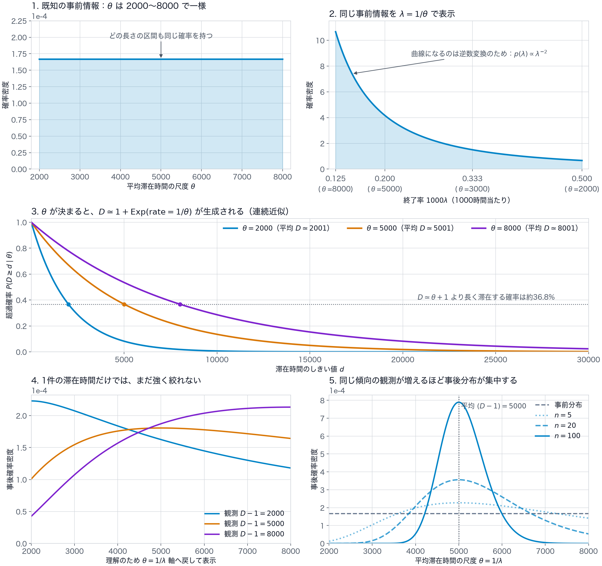

# Input Distribution

入力生成規則に依存する分布、期待値、近似、代表値、観測上の偏りを記録する。
任意の有効入力で必ず成り立つ性質は `notes/important_properties.md`、solver に依存する実験結果は `notes/journal.md`、`notes/backlog.md`、`results/` に記録する。
記号の定義、型、制約は `notes/notations.md` を参照する。

以下で「近似」とした値は、主として `l[i] >= 100000` の再生成と、全ての `S[i]`, `T[i]` を相異ならせる再生成の影響を省いたものである。
前者の発生確率は `θ = 8000` でも約 `3.73 × 10^-6` である。
後者は有限個の時刻を重複なしで使うことによる百分率程度の補正を持ちうる。

## 基本分布

### 人数の分布

`X ~ Uniform(2, sqrt(150))`, `P[i] = round(X^2)` なので、`4 <= p <= 150` に対して

$$
Pr(P[i]=p)
=
\frac{
\min(\sqrt{150},\sqrt{p+0.5})
-\max(2,\sqrt{p-0.5})
}{
\sqrt{150}-2
}
$$

である。
丸めを含めたモーメントは次の通りである。

- `E[P[i]] = 59.4974499956`
- `E[P[i]^2] = 5377.76782977`
- `SD(P[i]) = 42.8698177485`

人数は価値密度の生成要因ではほぼ相殺されるため、主に配置難度、連結成分の選択、断片化への影響として扱う。

### $\theta$ と平均滞在時間

丸めと再生成の影響を省くと、$D[i]-1$ は平均 $\theta$ の指数分布に従うと近似できる。
したがって、平均滞在時間は

$$
E[D[i]\mid\theta]
\simeq
\theta+1
$$

となる。
個々の $D[i]$ は大きくばらつくため、この式は一つのグループの滞在時間を予測するものではない。
この関係により、後述する時間平均需要を $\theta$ の式で表せるとともに、到着済みグループの $D[i]-1$ から未知の $\theta$ を推定できる。

### 芝生マス数の分布

`num_cluster = round(2^randf(1, 8))` の丸めを含めると、

- `E[num_cluster] = 52.3450182545`
- `SD(num_cluster) = 63.3492830550`

である。
`num_pond` の条件付き一様分布まで含めた芝生マス数は、

- 期待値 `2023.82749087`
- 標準偏差 `247.700559261`
- 範囲 `1600..=2498`

となる。
ただし solver は入力された実際の芝生マス数と連結成分を使うべきであり、この分布はケース難度の出現割合を考えるためのものである。

### 移動コスト係数の分布

`R = rand(1, 100) × 0.001` なので、`E[R] = 0.0505` である。
1 回の移動コストは概ね `R × V[i]` であり、理論平均では基本支払額の約 5.05% を失う。

実際の `R` は初期入力で既知なので、平均値で判断せずケースごとに使う。
高 `R` では多数の全体再配置を避け、低 `R` では高価値グループを受け入れるための局所再配置を検討する。

## 複合的な数値特性

### 時間平均需要の期待値

人数と滞在時間の独立性を用いると、入力生成時の `θ` を条件とした時間平均占有セル数の期待値は近似的に

$$
\frac{M E[P[i]]E[T[i]-S[i]\mid\theta]}{100000}
\simeq
0.5949745(\theta+1)
$$

となる。

- `θ = 2000`: 約 `1191` セル
- `θ = 3400`: 約 `2024` セル
- `θ = 5000`: 約 `2975` セル
- `θ = 8000`: 約 `4760` セル

### 容量不足と `θ` の境界

芝生マス数を実装上の局所量 `grass_count` とすると、時間平均需要が容量に一致する境界は近似的に

$$
\theta
\simeq
\frac{grass\_count}{0.5949745}-1
$$

である。
平均的な芝生マス数では境界が `θ ≈ 3400.54` となる。

`θ` の一様分布と芝生マス数の生成分布を合わせると、時間平均需要が芝生マス数を超える確率は、重複時刻の補正前で約 `0.76653` である。
したがって固定の受け入れ閾値は不適切であり、低 `θ` ケースでは広く受け入れ、高 `θ` ケースでは価値選別を強める必要がある。

平均的な芝生マス数に対する負荷率と、容量だけから決まる採択可能セル時間率は次の通りである。

| `θ` | 負荷率 | 採択可能セル時間率 |
|---:|---:|---:|
| `2000` | `0.588` | `1.000` |
| `5000` | `1.470` | `0.680` |
| `8000` | `2.352` | `0.425` |

これは空間的断片化と時間ごとの需要変動を無視した緩和値である。
実際の入場判定では、現在受け入れているグループの退去時刻までの予約量と、配置可能性を追加で考慮する。

### セル時間あたり価値の分布

丸めと `10^8` への上限制限を無視すると、生成式から

$$
\frac{V[i]}{P[i](T[i]-S[i])^{0.9}}
\simeq
2^{gauss(0,0.8)}
$$

および

$$
\frac{V[i]}{P[i](T[i]-S[i])}
\simeq
(T[i]-S[i])^{-0.1}2^{gauss(0,0.8)}
$$

を得る。
よって人数 `P[i]` はセル時間あたりの生成価値には直接効かず、滞在時間の影響も `-0.1` 乗と弱い。
価値差の主因はガウス項である。

正規化した品質 `V[i] / (P[i](T[i]-S[i])^0.9)` の近似分布は次の通りである。

- 10% 点: `0.49133`
- 中央値: `1`
- 平均: `1.16619`
- 90% 点: `2.03530`

滞在時間が 2 倍になってもセル時間あたり価値は `2^-0.1 ≈ 0.93303` 倍にしかならない。
単純な短期優先より、基本支払額からガウス項相当の品質を復元して選別する方が生成則に即している。

空間制約を無視し、滞在時間の `-0.1` 乗も一旦無視した近似では、平均的な芝生マス数に対する正規化品質の採択閾値は次の程度になる。

- `θ = 5000`: 約 `0.771`
- `θ = 8000`: 約 `1.110`

実際にはコンパクト度と滞在時間を含め、`round(V[i] × C[i]) / (P[i](T[i]-S[i]))` に基づいて判定する。

## θ のオンライン推定

### 到着順 prefix による観測の偏り

到着順 prefix の滞在時間平均は、`θ` の単純な不偏推定量ではない。
滞在時間が長いほど開始可能時刻の区間が短く、遅い時刻には到着できない。
このため、到着順の先頭では長期滞在グループが相対的に多く、末尾では長期滞在グループが打ち切られる。

オンラインで `θ` を推定するときは、観測済み滞在時間の単純平均だけでなく、現在の到着時刻までに未到着である残り `M-i-1` グループの打ち切り情報を含める。
`θ` は整数 `2000..=8000` の一様事前分布なので、各候補の尤度または事後確率を離散的に管理できる。

### prefix 補正を省いた連続ベイズ推定

prefix 補正を省いた連続ベイズ推定では、観測数と滞在時間の累積値だけで事後分布を表せるため、グループが一つ到着するたびに行う更新の時間計算量と追加メモリはともに $O(1)$ になる。
この計算量なら、$\theta$ の推定に使う時間を小さく保ち、配置候補の生成、再配置探索、および将来シミュレーションへ計算時間を割り当てられる。
ただし、このモデルは到着順 prefix による観測の偏りを補正しないため、入力生成規則に対する厳密な事後分布ではない。

#### モデル

離散値である $\theta$ を連続変数とみなし、事前分布を

$$
\theta\sim \operatorname{Uniform}(2000,8000)
$$

と近似する。
終了率を $\lambda=1/\theta$ とすると、変数変換後の事前分布は

$$
p_0(\lambda)
=
\frac{1}{6000\lambda^2},
\qquad
\frac{1}{8000}\le\lambda\le\frac{1}{2000}
$$

となる。
この事前分布は、$\lambda$ に新しい分布を仮定したものではなく、既知の $\theta$ の一様事前分布を逆数の座標へ移したものである。

丸めと再生成を省略し、到着済みグループの滞在時間を

$$
D[k]-1\mid\lambda
\sim
\operatorname{Exp}(\lambda)
$$

と近似する。
この近似は、ケースごとに一つの $\theta$ が選ばれて全グループで共有されることと、$D[k]-1$ が指数分布から生成されることを保っている。

#### 事後分布と更新則

到着済みグループ数を $n$ とし、指数分布標本の累積値を

$$
Y_n
=
\sum_{k=0}^{n-1}(D[k]-1)
$$

とする。
このとき、$\lambda$ の事後分布は

$$
p_n(\lambda)
\propto
\mathbf{1}_{[1/8000,\,1/2000]}(\lambda)
\lambda^{n-2}e^{-Y_n\lambda}
$$

となる。
新しくグループ $n$ が到着したときは、

$$
Y_{n+1}=Y_n+D[n]-1
$$

だけを計算し、観測数を $n+1$ に更新すればよい。
事後分布の正規化定数は、この逐次更新には必要ない。

$n\ge1$ で単一の推定値だけが必要なら、$\theta$ の事後確率密度の最頻値を

$$
\hat{\theta}^{\mathrm{mode}}_n
=
\operatorname{clip}\left(
\frac{Y_n}{n},
2000,
8000
\right)
$$

と計算できる。
事後分布の不確実性も将来予測へ反映する場合は、$E[1/\lambda\mid D[0],\ldots,D[n-1]]$ の一次元積分、または有限区間上の事後分布からのサンプリングを必要な時点だけで行う。
$E[1/\lambda\mid D[0],\ldots,D[n-1]]$ は一般に $1/E[\lambda\mid D[0],\ldots,D[n-1]]$ と一致しない。

#### 利点

- 既知の $\theta$ の範囲と一様事前分布を保つため、任意のガンマ事前分布を $\lambda$ に置く近似よりも入力生成規則に忠実である。
- 指数分布近似の尤度は $n$ と $Y_n$ に集約されるため、6001 個の $\theta$ 候補や数値積分用の格子を到着ごとに更新する必要がない。
- 事後確率密度は一変数で単峰または境界へ向かって単調になるため、複数のモードを保持する近似を必要としない。
- 事後分布は一次元の有限区間上で評価できるため、必要になった時点の点推定、数値積分、およびサンプリングも小さい計算量で行える。
- $\theta$ 推定の計算を小さく抑えることで、連結成分を保つ配置探索や再配置探索など、スコアへ直接関わる処理へ計算時間を残せる。

#### 制約

- 到着済みグループを、到着時刻で条件付けられていない独立な指数分布標本として扱うため、到着順 prefix に含まれる打ち切り情報を利用できない。
- 到着順の先頭では長期滞在グループが相対的に多いため、prefix 補正を省くと $\theta$ を上方へ推定しやすい。
- $\theta$ の整数性、指数分布標本の丸め、`D <= 100000` にする再生成、および時刻の重複を避ける再生成を省略している。
- 事後平均や分位点を使う場合は一次元積分またはサンプリングが必要であり、最頻値だけを使う場合よりは計算量が増える。

このモデルは、生成規則の主要部分を保ちながら逐次更新を $O(1)$ にする軽量な基準モデルとして使う。
prefix による推定誤差が受入判断や将来シミュレーションへ無視できない影響を与える場合は、現在時刻まで未到着であるグループの尤度を追加して補正する。

### prefix 補正を考慮した軽量近似連続ベイズ推定

#### 実装上の結論

実装では、prefix 生存確率を7次のモーメント展開で近似し、前回の推定値を初期値とする逐次Newton更新によって $\theta$ を推定する。

使用する定数は次のとおりである。

- 時刻上限：$H=100000$
- モーメント近似の次数：$K=7$
- 区間探索を行う観測数：$n\le32$
- 序盤の区間探索回数：12回
- それ以降のNewton更新回数：2回
- 探索変数の範囲：$12.5\le\beta\le50$

探索変数には、

$$
\beta=\frac{H}{\theta}
$$

を用いる。

オンライン推定器が保持する状態は、観測数 $n$、滞在時間の累積値 $Y_n$、および前回の推定値 $\hat\beta_n$ の三つである。

グループが到着したときは、

$$
Y_{n+1}=Y_n+D[n]-1
$$

と更新する。

最初の32グループでは、区間 `[12.5,50]` に対して固定12回の一次元探索を行う。
それ以降は、前回の $\hat\beta$ を初期値として保護付きNewton更新を2回行う。

7次の prefix 生存確率だけを評価するときは $u_0,\ldots,u_7$ を計算し、Newton更新では微分も必要になるため $u_0,\ldots,u_9$ を計算する。

推定結果は、

$$
\hat\theta_n=\frac{H}{\hat\beta_n}
$$

によって $\theta$ へ戻す。

1ケースの通常経路で計算するモーメント項は約 `22432` 個、指数関数は約 `2320` 回であり、追加メモリは $O(1)$ である。

観測数32とNewton更新2回は計算量を見積もるための暫定値であり、推定器単体の検証後に確定する。

#### prefix 情報を含む事後分布

$n\ge1$ 個のグループを観測した時点を考える。

現在の到着時刻、未到着グループ数、および観測済み滞在時間の累積値を

$$
s_n=S[n-1],
\qquad
r_n=M-n,
\qquad
Y_n=\sum_{k=0}^{n-1}(D[k]-1)
$$

とする。

$\theta$ の下で任意の一グループが時刻 $s$ より後に到着する確率を

$$
Q_\theta(s)
=
\Pr_\theta(S>s)
$$

とする。

未到着の $r_n$ グループはすべて $S>s_n$ を満たすため、prefix 情報を含む $\theta$ の事後密度は

$$
p_n(\theta\mid\mathrm{prefix})
\propto
\mathbf{1}_{[2000,8000]}(\theta)
\theta^{-n}
\exp\left(-\frac{Y_n}{\theta}\right)
Q_\theta(s_n)^{r_n}
$$

となる。

prefix 補正を省いたモデルとの違いは、

$$
Q_\theta(s_n)^{r_n}
$$

である。

$\theta$ が大きいほど長期滞在グループが増え、遅い時刻に開始できる確率が下がる。
このため、未到着グループの尤度は、到着順 prefix の滞在時間平均から生じる $\theta$ の上方偏りを補正する。

#### prefix 生存確率の連続近似

正規化した残り時間を

$$
a=\frac{H-s}{H}
$$

とする。

丸め、再生成、および時刻の重複回避を省くと、prefix 生存確率は

$$
Q_\theta(s)
\simeq
\int_0^a
\frac{a-z}{1-z}
\beta e^{-\beta z}\,dz
$$

と表せる。

被積分関数に含まれる分数は

$$
\frac{a-z}{1-z}
=
1-\frac{1-a}{1-z}
$$

と変形できる。

さらに、

$$
\frac{1}{1-z}
=
\sum_{k=0}^{K}z^k
+
\frac{z^{K+1}}{1-z}
$$

と展開する。

正規化した打ち切りモーメントを

$$
u_k(\beta,a)
=
\int_0^a
z^k\beta e^{-\beta z}\,dz
$$

とすると、$K$ 次近似は

$$
\widetilde Q_K(\beta,a)
=
u_0(\beta,a)
-
\frac{s}{H}
\sum_{k=0}^{K}u_k(\beta,a)
$$

となる。

各モーメントは

$$
u_0(\beta,a)
=
1-e^{-\beta a}
$$

$$
u_k(\beta,a)
=
\frac{k}{\beta}u_{k-1}(\beta,a)
-
a^k e^{-\beta a}
$$

によって順に計算できる。

同じ $e^{-\beta a}$ を全モーメントで再利用できるため、一つの $\beta$ に対する指数関数の評価は一回で済む。

#### 7次近似を選ぶ理由

$K$ 次近似による prefix 生存確率の絶対誤差を $R_K$ とすると、

$$
0
\le
\widetilde Q_K-Q_\theta(s)
\le
R_K
\le
(K+1)!
\left(\frac{\theta}{H}\right)^{K+1}
$$

となる。

最悪条件 $\theta/H=0.08$ に対する誤差上界は次のとおりである。

| 次数 $K$ | $R_K$ | $MR_K$ |
|---:|---:|---:|
| 5 | $1.89\times10^{-4}$ | $0.189$ |
| 6 | $1.06\times10^{-4}$ | $0.106$ |
| 7 | $6.76\times10^{-5}$ | $0.068$ |
| 8 | $4.87\times10^{-5}$ | $0.049$ |

近似誤差を $\delta=\widetilde Q_K-Q_\theta(s)$ とすると、prefix 対数尤度の誤差は

$$
0
\le
r_n\log\frac{\widetilde Q_K}{Q_\theta(s)}
\le
\frac{r_nR_K}{Q_\theta(s)}
$$

で抑えられる。

生成分布に従う典型的な prefix では、

$$
r_n\simeq M Q_\theta(s)
$$

となる。

この場合、prefix 対数尤度全体への誤差規模は

$$
\frac{r_nR_K}{Q_\theta(s)}
\simeq
MR_K
$$

と見積もれる。

典型的な prefix に対する誤差の目安を `0.1` 未満とすると、この条件を満たす最小次数は $K=7$ である。

5次へ下げてもモーメント計算は約20%しか減らず、誤差上界は7次の約2.8倍になる。
したがって、計算量を減らす場合も次数は7に保ち、目的関数の探索回数を減らす方がよい。

#### 逐次Newton更新

以下では、$\beta$ の事後密度ではなく、前節と同じく $\theta$ の事後密度の最頻値を求める。
したがって、$\theta=H/\beta$ を $\theta$ の事後密度へ代入した目的関数を最大化し、変数変換のヤコビアンは掛けない。

定数項を除いた目的関数を

$$
g_n(\beta)
=
n\log\beta
-\frac{Y_n}{H}\beta
+r_n\log\widetilde Q_7(\beta,a)
$$

とする。

モーメントの微分は

$$
u_k'(\beta,a)
=
\frac{u_k(\beta,a)}{\beta}
-u_{k+1}(\beta,a)
$$

$$
u_k''(\beta,a)
=
u_{k+2}(\beta,a)
-\frac{2u_{k+1}(\beta,a)}{\beta}
$$

となる。

このため、$u_0,\ldots,u_9$ を一度計算すれば、

$$
\widetilde Q_7,
\qquad
\widetilde Q_7',
\qquad
\widetilde Q_7''
$$

を同時に得られる。

目的関数の微分は

$$
g_n'(\beta)
=
\frac{n}{\beta}
-\frac{Y_n}{H}
+r_n\frac{\widetilde Q_7'}{\widetilde Q_7}
$$

$$
g_n''(\beta)
=
-\frac{n}{\beta^2}
+r_n
\left(
\frac{\widetilde Q_7''}{\widetilde Q_7}
-
\left(
\frac{\widetilde Q_7'}{\widetilde Q_7}
\right)^2
\right)
$$

となる。

通常のNewton候補は

$$
\beta_{\mathrm{new}}
=
\beta-\frac{g_n'(\beta)}{g_n''(\beta)}
$$

である。

$g_n''(\beta)<0$ であり、Newton候補が探索区間内にある場合は、この候補を次の推定値とする。
$g_n''(\beta)\ge0$ またはNewton候補が探索区間を外れる場合は、探索区間内に更新を制限する。

観測が蓄積した後は、一グループの追加による最頻値の移動が小さくなると期待できるため、前回の推定値を初期値とする2回のNewton更新を計算量見積もりの基準とする。
ただし、到着時刻が大きく飛んだ場合にも2回で十分かどうかは、推定器単体で確認する必要がある。

#### 計算量

最初の32グループでは、各到着について12回の区間探索を行い、各評価で $u_0,\ldots,u_7$ を計算する。

この部分のモーメント項数は

$$
32\times12\times8
=
3072
$$

となる。

残りの968グループでは、各到着について2回のNewton更新を行い、各更新で $u_0,\ldots,u_9$ を計算する。

この部分のモーメント項数は

$$
968\times2\times10
=
19360
$$

となる。

1ケース全体の通常経路では、

$$
3072+19360
=
\boxed{22432}
$$

モーメント項を計算する。

指数関数の評価回数は

$$
32\times12+968\times2
=
2320
$$

回である。

モーメントの次数と更新回数は固定されているため、到着ごとの時間計算量と追加メモリはともに $O(1)$ である。

prefix 補正を省いたモデルより定数倍の計算を必要とするが、時刻上限に比例する事前計算や記憶領域を必要としない。

実際のCPU時間は、推定器単体のベンチマークで確認する。

#### 数値計算と未検証事項

$\beta a$ が小さい終盤では、モーメントの漸化式に桁落ちが生じる可能性がある。
実装では `expm1` を用い、必要なら小さい $\beta a$ に対する級数計算へ切り替える。

このモデルは、$\theta$ の整数性、指数分布標本の丸め、`D <= 100000` にする再生成、および時刻の重複回避を省いている。

$MR_K$ は典型的な prefix に対する誤差の目安であり、任意の prefix に対する上界ではない。

区間探索から切り替える観測数を32とすること、Newton更新を2回とすること、および近似した事後密度の単峰性は未確認である。

solverへ組み込む前に、入力生成規則に忠実な事後分布を参照値として、推定誤差、Newton更新の収束、およびCPU時間を推定器単体で確認する。

#### 結論

prefix 補正を考慮した軽量近似連続ベイズ推定には、7次モーメント近似と逐次Newton更新を用いる。

序盤は固定回数の区間探索を行い、それ以降は前回の推定値から保護付きNewton更新を2回行う。

この構成では、未到着グループの尤度を反映しながら、到着ごとの時間計算量と追加メモリを $O(1)$ に保てる。

1ケースあたりの通常経路では、約 `22432` 個のモーメント項と約 `2320` 回の指数関数を計算する。

7次を選ぶ根拠は、典型的な prefix に対する対数尤度誤差の目安を `0.1` 未満に保つ最小次数だからである。

観測数32とNewton更新2回は理論から確定した値ではないため、推定器単体の検証結果によって確定する。
