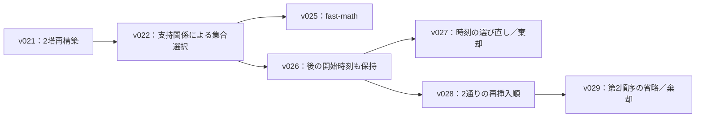

# 実験全体から見た次の組み合わせ候補

次の本命は、v026を基準に、**案1の支持関係を2塔再構築の相手選びへ使う組み合わせ**である。短い実装で試せる別候補は、v025の `fast-math` をv026へ取り込むことだ。

今回はbacklog全体、重要な性質、v001〜v029の系譜、保存評価、関連コードを照合した。実験本文を読み直して新案を拾うことはせず、観察と実装の未接続部分から候補を導いた。新しいソルバーの実装、再構築器の呼び出し、本評価は行っていない。追加分析は保存済みv026の操作列の再生だけである。

調査中に別途登録されたv030の盤面コピー形式比較は進行中で、結果待ちである。

## 実験の流れ

| 範囲 | 主に試したこと | 組み合わせを考える上での整理 |
|---|---|---|
| v001〜v006 | 混色集荷、同色集約木、固定と移動の踏み台、複数枝の再接続 | 踏み台の構築費と回収費を含めること、混載と集約を併用することが基本になった。 |
| v007〜v008 | 差分評価と軽量化 | 維持費まで含めない高速化は失敗した。配列や作業領域の再利用という方針は現行にもある。 |
| v009〜v011 | 踏み台の配置と帰巣順、高さ別の網、配送グループの再分割 | 複数の配送で踏み台を共有する構築が進んだ。便単位の構成から操作列を扱う後続版へ移っている。 |
| v012〜v018 | 構築の枝刈り、混色の集荷木、継続配送、帰巣延期、出力修復 | 構築段階で短くなっても、後処理込みの完成版では逆転する例が複数あった。旧構築を丸ごと足す場合は時間配分も変わる。 |
| v019〜v021 | 個体の除去と再挿入、変化箇所からの探索更新、塔の分解、2塔の再構築 | 操作列を広く解き直す構成が現在の土台となった。 |
| v022〜v029 | 支持関係による集合選択、別の開始時刻、再挿入順の比較と省略、速度改善 | 有効な局所変更は発生したが、完成版の差は小さい。計算負担と他の近傍の探索機会を合わせて見る必要がある。 |

保存評価の節目は、v003が平均271.76手、v010が257.43手、v015が239.43手、v019が235.29手、v020が211.22手、v021が209.53手、v026が209.00手、v028が208.94手である。全100件の合計を100で割った値を使い、CSVの丸められた平均欄は使っていない。旧版間には時間配分や複数の実装変更があり、この差を個々のアイデアの効果とは扱わない。

最近の系譜は次のとおりである。

v028には案1、案2、案3が既に同居している。`fast-math` の枝は合流していない。また、支持関係による選択と2塔の相手選びは、現行でも別々に動いている。

## 第一候補：支持関係で2塔の相手を選ぶ

### 組み合わせるもの

- v021の2塔再構築：途中時点の2塔から上段を取り除き、その後だけを解き直す。
- v022の支持関係：取り除いた個体が踏み台になっている後続ジャンプを見つけ、その利用側も対象に含める。
- v026の開始時刻：最初の出現に加え、後の時刻も再構築の入口として残す。

根拠はO30、O32、O35と今回の保存解分析である。新案はB-40へ記録した。

### 現在の未接続部分

`growDependency` は、支持関係から個体集合を広げ、初期位置からの再挿入へ渡す。一方、`pairedNeighbor` は途中時点の盤面を復元するが、相方を選ぶ主な尺度は2塔間の距離と巣間の距離である。将来の支持関係は相方の順位に入っていない。

新案では、先に選んだ塔の上段を除くと壊れる後続ジャンプを調べる。その利用側が別の1塔の上段に収まる場合、その塔を相方として優先する。現在の距離10以内という候補範囲、除去人数の上限、開始時刻の選び方、2塔近傍の試行頻度、再挿入器は保つ。変更の中心を相方選択へ限定する。

これにより、初期からの集約を保ったまま、踏み台と利用側の後半の動きを一緒に変更できる可能性がある。v022と同じ人数でも、やり直す操作列が短くなる場合がある。ただし、関係を調べる追加費用と実際の候補品質は未測定である。

### 保存解に対象があるか

全100出力を合法性と全回収を確認しながら再生した。以下は通常99件の集計である。v026が保持する最初と後の候補時刻を取り、同じ時刻は1つにまとめた。まず既存の2塔近傍と同じ上限と塔の切り方で、支持を失う将来の利用側を同時に取り出せるかだけを調べた。

| 指標 | 最大6匹 | 最大8匹 |
|---|---:|---:|
| 調べた開始時点 | 14,766 | 14,786 |
| 現在の相方候補内に支持関係のある塔が見つかった時点 | 3,046 | 4,473 |
| そのような時点を持つケース | 99 / 99 | 99 / 99 |
| 条件を満たす相方の組 | 3,710 | 5,769 |
| うち現在の順位で上位12位より下 | 730 | 989 |
| 後の開始枠にも属する該当時点 | 1,113 | 1,671 |

最大6匹では、調べた時点の20.63%に対象があった。条件を満たす相方の19.68%は現在の順位で上位12位より下だった。現行にも全候補から無作為に選ぶ経路があるため、この730組が探索不能という意味ではない。支持関係を使えば選択確率を変えられる、という証拠である。

この分析は、対象の存在と相方の現在の順位を示す。完成後の操作数、修復回数、再挿入の成功率は測っていない。同じ個体や将来のジャンプが別の開始時刻にも現れ、各組の改善量を足せるとも限らない。

静的分析では、主塔から取り出せる最大の上段を使った。主塔の切り方を無作為に変える場合や、探索途中の分布は再現していない。最大6匹と8匹の結果も重なるので合算しない。

### 実験に進むときの比較

v026を基準とし、同じ保存途中盤面で相方選択を変えた候補の修復数、完成率、完成手数、処理時間を確認する。その後、同じ制限時間で全100件を1回評価し、完成版の合計Tで採否を決める。新しい候補集合の試行枠を追加する変更や、再挿入順の追加は同時に入れない。

## 第二候補：v026へv025のfast-mathを取り込む

根拠はB-34とO37である。新案はB-41へ記録した。

v025はv022に `fast-math` だけを足した枝だが、v026とv028の最適化指定には含まれていない。v026への処理差はコンパイラ指定の1行に限定できる。LOCALと非LOCALの両方に効く。

v025の保存評価では、通常99件の探索試行数がv022比7.22%増えた。全100件なら7.36%増である。一方、完成版は26手増、0.1241%悪化した。過去の「採用を維持」は事前の再検討基準0.3%を下回ったためであり、スコアを改善したという意味ではない。

したがって、これは小さな差分で探索機会を増やせるか確かめる候補である。今回の組み合わせでは、v026より完成版の合計Tが下がるかを見る。試行増だけを採用理由にはしない。浮動小数点計算の差によって探索順や受理も変わり得るため、過去の7.22%をそのまま期待速度として使わない。

## 優先しない組み合わせ

- **v023とv024の高速化を追加する案**：結果を一致させた固定仕事量の比較で、どちらも明確な時間短縮が得られなかった。2順序を使うことだけでは、維持費との収支が改善する根拠にならない。
- **v027とv029を再び載せる案**：本評価で棄却済みであり、今回の調査で再開条件を満たす新しい証拠は得られていない。
- **v016やv018の構築を丸ごと載せる案**：旧版は個体ID付きの便、配送順、設置計画を前提にする。現行の構築とLNSへ接続するには表現と時間配分の変更が必要になる。現行にも途中の帰巣後に再集荷する処理や、個体を待たせて踏み台に使う処理があり、追加する探索能力の特定が先になる。

v018の留置では回収費込みの短縮を確認しているため、その観察は残る。ただし、旧版の116手短縮に現行LNSの短縮量を足して改善幅を予測することはできない。現時点ではB-23の再開条件を更新しない。

## 比較元と進め方

まずはv026を比較元にする。v028は保存評価で6手良いが、全体の試行数は8.525%少なく、案3の安定した優位は未確認である。新しい相方選択やコンパイラ指定の効果を確認する段階では、案3による追加計算を同時に持ち込まない方が差を読み取りやすい。

推奨順は、第一候補の固定状態での診断から着手し、成立すればその完成版を評価することだ。短い実装の実験を先に挟むなら第二候補を選べる。両候補を最初からまとめず、どちらが完成スコアへ効くか確認した後に、組み合わせを別の実験として判断する。

## 根拠と再現用資料

- 実験全体の観察と判断: [backlog](/Users/masaki/Desktop/AHC072/notes/backlog.md)
- 保存評価の正本: [score_summary.csv](/Users/masaki/Desktop/AHC072/results/score_summary.csv)、[eval_records.jsonl](/Users/masaki/Desktop/AHC072/results/eval_records.jsonl)
- 支持関係による集合生成: [v026のgrowDependency](/Users/masaki/Desktop/AHC072/src/bin/v026_late_start_lns.cpp:1111)
- 現在の2塔の選択: [v026のpairedNeighbor](/Users/masaki/Desktop/AHC072/src/bin/v026_late_start_lns.cpp:1637)
- 初期構築の部分帰巣と再集荷: [v026のdeliveryEvent](/Users/masaki/Desktop/AHC072/src/bin/v026_late_start_lns.cpp:789)
- v025の保存評価: [summary.json](/Users/masaki/Desktop/AHC072/adhoc/v025_fast_math/summary.json)
- 今回の再生分析: [summary.json](/Users/masaki/Desktop/AHC072/adhoc/merge_candidate_analysis/summary.json)、[相方一覧](/Users/masaki/Desktop/AHC072/adhoc/merge_candidate_analysis/dependency_pairs.csv)
- 再生分析コード: [analyze_merge_candidates.py](/Users/masaki/Desktop/AHC072/adhoc/scripts/analyze_merge_candidates.py)

再生対象はv026の保存run_id `20260927T172632+0900_v026_late_start_lns_973c99`。ソースのSHA-256は `83fbf8fd338c22f4f5809a5b4a5be5df751cc2e137323ce76027187c4dca04ed` である。入力と出力のハッシュも今回の集計に保存した。
