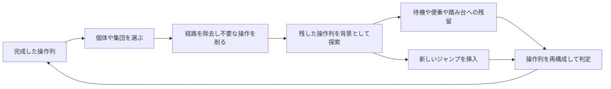

# AHC072 解法資料

既存の操作列を活用するLNS、複数個体の協調探索、初期解のビームサーチ、複数解の交叉、学習による探索配分を調べるための資料である。将来のコンペでは、下の「問題の特徴から探す」から関連する解説を選び、各記事冒頭の適用条件と状態表現を確認する。

AHC072は、色付きの個体を高さ8以下の塔に積み、塔の上部を反転して跳ばし、同じ色の巣へ全員を帰す問題だった。下に残す個体数が飛距離を決めるため、個体は輸送対象と踏み台を兼ねる。全員帰巣した解では操作回数を最小化する。この「輸送と支援が相互依存する」構造が、以下の手法の背景にある。

## 問題の特徴から探す

| 次の問題や探索で見えた特徴 | 参考になる設計 | 解説 |
| --- | --- | --- |
| 完成した計画の一部を外して戻したい。既存の輸送や操作へ便乗できる | 残した計画を背景とする時空間再挿入。追加費用を探索する | [mech_39](mech_39.md) |
| 一部を外すと別の操作が成立しなくなる。複数の対象がその不足を補える | 不足条件の保持、後続対象への引き継ぎ、役割の分担 | [mech_39](mech_39.md)、[失敗例と費用の考察](conditional_support_review.md) |
| 一つずつ動かすと改善しない。小さな集団なら合流や分割を一緒に決められる | 属性の並びを少数の型へ圧縮する集団DP | [melo25](melo25.md) |
| 合法な1手を列挙できるが、貪欲構築では合流や先送りを比較できない | 盤面ビームによる初期解構築 | [asi1024](asi1024.md) |
| よい変更には一時的な制約違反が必要で、後から修復できる | 違反を追跡する探索と、合法な最良解の別保存 | [asi1024](asi1024.md) |
| 同じ資源を使う時刻が重要。独立な操作の順番を変えられる | 操作依存DAGと経路を同時に探索する | [Moegi](Moegi.md) |
| 全体計画は大きいが、少数操作の前後の状態を一致させられる | 同じ境界状態に到達する局所操作列の短縮 | [Moegi](Moegi.md) |
| 複数の対象の経路が共有される。具体的な手順は高価だが輸送量は見積もれる | 輸送木の改善と、ビームによる具体化の反復 | [titan23](titan23.md) |
| 複数の解が別々の場所で良い。共通する局所状態や全体状態がある | 部分解交叉と、共有状態を頂点にした最短路 | [sadtreap](sadtreap.md) |
| 入力によって有効な近傍や時間配分が変わる。事前の計算資源を使える | 入力特徴から探索設定を選ぶ軽量モデル | [syndrome](syndrome.md) |
| 対象の追加が、残した計画の操作数も減らす | 挿入費用に加えて既存操作の短縮利益を扱う | [Ang107](Ang107.md) |

検索語：LNS、破壊再構築、時空間探索、0-1 BFS、再挿入、依存関係、支持不足、協調探索、集団DP、状態圧縮、ビームサーチ、制約緩和、操作依存DAG、局所短縮、集約木、輸送木、交叉、複数解、機械学習、アルゴリズム選択、時間配分。

別コンペでの適用条件は、確認した実装からの設計考察である。元コンペの制約や定数をそのまま移す前提にはしない。順位は組み合わせた解法全体の結果であり、表の各手法の単独効果を保証するものではない。

## 個別解説の読み方

各記事は「将来の問題で参照する条件」「AHC072での具体的な実装」「改善が生まれる仕組み」「我々との比較と出典」の順に読む。冒頭に、適用できる構造、必要な状態表現、持ち出せる設計、計算量や正しさの制限を記した。

たとえば、次の問題で破壊後の修復に手数を使い切るなら、mech_39 の不足を残す設計を読む。そこで不足の内容を自分の問題の制約へ対応づけ、誰がいつ補えるかを状態にできるかを判断する。新しい操作が既存計画の費用も減らすなら、Ang107 の短縮利益も併せて読む。

採否を考える際は、新しい機構の発動、元の解からの純粋な改善、既存後処理後にも残る利益、計算費用を含む完成結果を分ける。条件付き支持の[反省資料](conditional_support_review.md)には、それらが一致しなかった実例がある。

## 調査対象

2026年10月5日のコンテスト終了後に表示された[順位表](https://atcoder.jp/contests/ahc072/standings)を対象とする。順位表に載っていた提出を全20人について開き、主処理と、その方針を担う構築関数や探索関数を読んだ。順位は調査時点の暫定順位である。

大方針は、初期解をどう作るかと、完成した解の何を動かすかで分かれる。同色の集約木、盤面のビームサーチ、時空間での経路の再挿入は複数人に共通する。その中から、集団の表現、操作順の扱い、複数解の利用、学習済みモデルの利用に違いがある8人を個別解説に選んだ。分類は排他的ではなく、各人は複数の手法を組み合わせている。

## 個別解説

| 代表者 | 説明する方針 | 読むべき違い |
| --- | --- | --- |
| [mech_39](mech_39.md)（1位） | 同色の集約木を作り、関連個体を破壊して時空間探索で再挿入する | 木の集約と、便乗や踏み台を使う探索の接続 |
| [sadtreap](sadtreap.md)（3位） | 複数の解を改善し、部分解の交叉と盤面履歴の共有を行う | 別々の解の良い部分を組み合わせる |
| [melo25](melo25.md)（4位） | 同色の鎖から始め、混色の集団をまとめて再挿入する | 個体間の協力を集団の状態として扱う |
| [asi1024](asi1024.md)（5位） | 盤面全体のビームサーチで構築し、制約を一時的に緩めながら再挿入する | 初期解から合流と分割を探索する |
| [Moegi](Moegi.md)（9位） | 集団の経路変更と、操作の依存関係を使う区間書き換えを行う | 再挿入の中でも操作順を選び直す |
| [titan23](titan23.md)（10位） | 輸送経路の木を改善し、その構造を評価するビームサーチを行う | 抽象的な輸送計画と具体的な操作列を往復する |
| [syndrome](syndrome.md)（13位） | 構築と経路改善に、入力特徴から設定を選ぶ学習済みモデルを組み合わせる | 機械学習で探索時間と近傍の設定を選ぶ |
| [Ang107](Ang107.md)（18位） | 時空間再挿入で、踏み台によって既存操作を短縮できる利益も扱う | 挿入の費用と、既存操作を減らす利益を結びつける |

## 共通する時空間再挿入

**時空間再挿入**は、他のスライムの操作を残し、その時系列の中で取り除いた個体や集団の経路を作り直す方法である。状態には、操作列のどの時点か、どのマスにいるか、塔のどの段にいるかを持つ。混色の集団では、上下反転の向きや残っている色の並びも必要になる。

既存のジャンプに便乗できれば、追加の操作は不要である。出発点に残って踏み台になる場合も、追加操作を使わずに他の集団を助けられる。自分で新しいジャンプを挿入すると、追加手数が増える。この追加手数を費用にした最短路探索や動的計画法が、多くの提出の中心にある。ただし、輸送距離などの補助評価を加える実装では、追加手数が0でも評価値が変わる。

除去した個体が踏み台だった場合、残したジャンプの飛距離が足りなくなる。これを除去時に修復するか、再挿入する個体の義務として扱うか、一時的な違反として探索するかで設計が分かれる。個体の経路と、他の個体を支える役割を同時に扱う必要がある。

## 上位20人の確認結果

「本人コメント」は提出冒頭の説明を根拠とし、「コード読解」は関数の実装と呼び出しから整理した内容である。各行の提出リンクが一次資料であり、末列には読み直す際の入口となる識別子を記した。高速化の全実装や、開発中に試して棄却した手法まで網羅した表ではない。

| 順位 | 参加者と提出 | 初期解の作り方 | 改善の中心と特徴 | 根拠と読解の入口 |
| --- | --- | --- | --- | --- |
| 1 | [mech_39](https://atcoder.jp/contests/ahc072/submissions/79793411) | 少数色から、最大8匹の集約木を作ってグループ分けを焼く | 関連個体の除去と時空間再挿入、集団経路と操作順の変更 | 本人コメントの第2〜6項、`Context::anneal` |
| 2 | [c7c7](https://atcoder.jp/contests/ahc072/submissions/79770140) | 集約木と、木で大部分を運んで残りをDP挿入する候補を選抜 | 全経路、途中からの経路、局所ビーム、2体同時探索などを混ぜる | 本人コメント、`initialize_portfolio`、`InsertionDP::solve`、`improve` |
| 3 | [sadtreap](https://atcoder.jp/contests/ahc072/submissions/79791493) | 色順の探索、集約森、踏み台を配置する候補から複数解を作る | 集団再挿入、複数解の交叉、盤面履歴からの最短経路抽出 | コード読解、`optimizeColorOrder`、`armStep`、`componentCrossover`、`PathArchive` |
| 4 | [melo25](https://atcoder.jp/contests/ahc072/submissions/79794861) | 少数色から同色を最大7匹の鎖に分けて集める | 色の連続区間が3個以下の混合集団をまとめて再挿入 | 本人コメントとコード読解、`make_chains`、`make_types`、`solve` |
| 5 | [asi1024](https://atcoder.jp/contests/ahc072/submissions/79785033) | 盤面全体のビームサーチ | 単体と複数体の再挿入、途中からの再構築、飛距離不足の一時緩和と修復 | コード読解、`BeamInit`、`State::Expand`、`ReinsertSuffix`、`Run` |
| 6 | [k1suxu](https://atcoder.jp/contests/ahc072/submissions/79796586) | 木や貪欲構築の候補を集め、短時間改善して段階的に候補数を半減 | 個体と集団の再挿入、破壊再構築、操作順変更、局所書き換え | コード読解、`TreeBuilder`、`Greedy`、`Lane::advance`、`main` |
| 7 | [bayashiko](https://atcoder.jp/contests/ahc072/submissions/79795756) | 塔の色順を考慮する費用と同色の最小全域木を評価するビームを複数試す | 途中からのビーム再開、候補改善、集団の破壊再構築 | コード読解、`orderedCost`、`mstCost`、`beamSearchImpl`、`ruinRecreate` |
| 8 | [Piiiii](https://atcoder.jp/contests/ahc072/submissions/79797315) | 優先順や同色の集約上限が異なる8通りの貪欲解を作る | 集団再挿入に加え、局所盤面間の双方向探索と操作削除を行う | コード読解、`buildGreedySolution`、`packetSearch`、`regionSearch`、`local_rewrite::improve` |
| 9 | [Moegi](https://atcoder.jp/contests/ahc072/submissions/79796544) | 少数色から、遠い同色の塔を集めながら帰巣させる | 集団の区間経路変更、依存関係付き探索、少数操作の書き換え | 本人の冒頭コメントとコード読解、`buildWindow`、`searchDagWithStorage`、`TripleRewriter` |
| 10 | [titan23](https://atcoder.jp/contests/ahc072/submissions/79796955) | 既存解から輸送の木を抽出して改善し、ビームで操作列を作る | 木の更新とビームの反復、後半の再構築、時系列再挿入と局所短縮 | コード読解、`learn_net`、`build_net`、`tree_objective`、`beam_search::search` |
| 11 | [tishii24](https://atcoder.jp/contests/ahc072/submissions/79795188) | 色の優先度や集約数を変えた貪欲候補から選ぶ | 短区間の書き換え、輸送集団の区間変更、複数個体の再挿入、操作順変更 | コード読解、`construct_initial`、`Search`、`ShortSearch`、`solver::solve` |
| 12 | [Yuuki2028](https://atcoder.jp/contests/ahc072/submissions/79788493) | 輸送計画の構築と候補選抜 | 関連個体や途中の集団を除去し、踏み台の不足を修復しながらDPで戻す | コード読解、`plan::Builder`、`InsertDp`、`Lns::destroy`、`Lns::tryDestroyRepair` |
| 13 | [syndrome](https://atcoder.jp/contests/ahc072/submissions/79796139) | 集約木または経路構築を選び、集約と色順を改善 | 経路の協調的な改善に、学習済み線形モデルによる時間と設定の選択を組み合わせる | コード読解、`pipelineConfig`、`TraceOptimizer`、`budgetFeatures`、`selectContextualAction` |
| 14 | [gaha](https://atcoder.jp/contests/ahc072/submissions/79796977) | ビームで構築する | 集団または途中からの時空間再挿入、曲がり角変更、最良解からの再加熱 | コード読解、`beam_start::run`、`plan`、`main` |
| 15 | [mono_1729](https://atcoder.jp/contests/ahc072/submissions/79796379) | 集約木と、処理済み色集合を状態にした色順DPで候補を作る | 関連個体の破壊再構築、途中からの再挿入、少数操作の短縮、大きな再構築 | コード読解、`buildInitialCandidates`、`ruinRecreate`、`quickTwoPolish`、`improveAll` |
| 16 | [nono00](https://atcoder.jp/contests/ahc072/submissions/79785280) | 順序とグループ利用を変えた貪欲挿入を比較する | 集団の部分区間、同色の区間、踏み台を含む区間の再探索と操作圧縮 | コード読解、`run_greedy`、`RedInserter`、`Annealer`、`PlanCompressor` |
| 17 | [nikaj](https://atcoder.jp/contests/ahc072/submissions/79796511) | 容量と深さへの罰則が異なる木を作る | 単体、集団、輸送区間、局所盤面の書き換えを混ぜ、複数探索候補を選抜 | コード読解、`TreeSeed`、`Repair`、`DagLeg`、`SearchPatch`、`RunParallelSA` |
| 18 | [Ang107](https://atcoder.jp/contests/ahc072/submissions/79797177) | 個体順に時空間挿入して作る | 複数個体や区間の再挿入、踏み台による既存操作の短縮利益、良い解への誘導 | 本人コメントとコード読解、`build`、`direct_sa`、`cr_mode`、`MBIN_ARGS` |
| 19 | [montplusa](https://atcoder.jp/contests/ahc072/submissions/79795139) | 通常の木、ジャンプを考慮した木、色をまたいで経路を共有する木を比較する | 区間と混色集団の再探索、踏み台設置、依存関係を使う局所短縮 | コード読解、`construct`、`SharedForest`、`station_attempt`、`improve_seed` |
| 20 | [civitaskivi](https://atcoder.jp/contests/ahc072/submissions/79768480) | 狭い幅からのビームと幅調整、盤面の対称変換を使う | 時系列の再挿入、複数個体の経路再構築、制約違反を解消する連鎖修復 | コード読解、`solveBoard`、`autoBeam`、`multiRoute`、`ejectChain`、`Timetable::improve` |

## 比較から読み取れる設計上の違い

我々が試した条件付き支持との比較は、[条件付き支持が完成解の改善につながらなかった理由](conditional_support_review.md)に整理した。元の解の復元、既存短縮との重複、計算費用、探索範囲の制限を、保存記録に基づいて区別している。各人の個別解説にも、改善を作れる理由と我々との比較を追記した。

| 上位解法で確認した機構 | 新しい短縮を作れる理由 | 我々との比較で見る箇所 |
| --- | --- | --- |
| mech_39 の複数個体への支持不足の引き継ぎ | 支持役を分担し、乗り手の経路も変更できる | v314の1匹に課す必須支持条件との自由度の差 |
| melo25 の混色集団の状態探索 | 合流と分割を含む協力関係を一度の探索で比較できる | 我々の束や逐次再挿入が表せる状態の範囲 |
| asi1024 の一時的な支持不足と継続修復 | 1近傍で完了しない変更を複数回の探索へ分けられる | 1候補内で修復を完了させる条件との違い |
| Moegi の操作順を含む経路探索 | 踏み台が残る時刻と経路を一緒に選べる | 先に並べ替えて時系列を固定する処理との違い |
| titan23 の輸送木とビームの往復 | 既存の支持義務の前提になる輸送経路を選び直せる | 完成列の一部を保持した局所改善との範囲の差 |
| sadtreap の部分解交叉 | 別々に発見した短縮を共通状態で接続できる | 初期候補の育成や選抜と、候補間の交換との違い |
| syndrome の入力別の時間と設定の選択 | 有効な入力へ重い近傍の時間を配分できる可能性がある | NNが予測する対象と、時間配分の決め方 |
| Ang107 の既存操作を減らす支持の評価 | 支持の復元に加え、元の2操作を1操作にする利益を狙える | 我々にもある支持評価や短縮との検出範囲と接続の差 |

この表はコードから確認した機構と、その設計から説明できる改善の理由を対応づけたものである。各機構だけの得点寄与を測った結果ではない。

初期解の構築にも探索が使われている。asi1024 は操作列をビームで作り、mech_39 は集約木のグループ分けを焼き、sadtreap と mono_1729 は色順の組合せを扱う。初期解を完成させる前に、合流する相手や踏み台を残す順番を検討している。

改善の単位も個体だけに限られない。melo25 は混色のまとまり、Moegi は集団の経路区間と操作の依存関係、sadtreap は別々の解の部分計画を扱う。1匹ずつの経路変更では動かしにくい関係を、探索状態や近傍の側に取り込む設計である。

探索を制御する方法にも違いがある。複数候補を短時間改善して選ぶ方法、良い解の経路へ誘導する方法、入力特徴に応じて設定を学習済みモデルで選ぶ方法がある。syndrome の実装は、機械学習を既存のヒューリスティックに組み合わせる具体例になる。

この比較は提出の静的読解によるもので、各機構の得点への寄与を測定したものではない。特定の差分が順位差の原因だとは断定しない。長時間計算用の別実装や、開発中の実験手順についても、提出コードだけでは確認できない部分がある。

## 資料の範囲

構成と機構を比較するための解説であり、上位コードをそのまま移植できる実装仕様書ではない。各記事には追跡できる出典とコードの読解箇所を残したが、全分岐の正しさ、計算量の厳密な上限、各機構の単独効果は確認していない。次の問題で必要な状態や境界条件は、その問題に合わせて確かめる必要がある。

一次資料は各人の提出コードと、その中の説明コメントである。[AtCoderの解説一覧](https://atcoder.jp/contests/ahc072/editorial)では日本語の解説も表示して確認した。上位20人のうち、一覧で確認できた本人解説は mech_39 の[解説動画](https://www.youtube.com/watch?v=rza9mEkY12k)で、個別記事には読んだ画面の時刻を記載した。

外部検索では、ほかの上位参加者の本人による今回の解説記事は確認できなかった。記事が存在しないという意味ではない。動画の自動字幕は内容を正しく転記していなかったため、解釈の根拠に使っていない。
