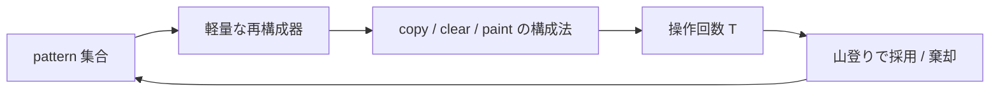

# Hill Climbing v1 Memo

## 目的

このメモは、pattern を少数または多数用意し、それらを上位レイヤーに構築して layer 0 へ `copy` し、最後に不足分を `paint` で埋める、という山登り方針の概念整理である。

ここでは大枠と、pattern 固定時の再構成器の基本方針までを固定する。残りの未確定部分は、pattern の表現と変更近傍まわりである。

## 方針の核

この問題では、layer 1, 2, ... に小さな pattern を書いておき、それを layer 0 に何度も `copy` することで、目標画像 `g` を構成できる。

また、`copy` だけで完全に一致しなくてもよい。最後に `paint` を使って不足分や壊れた部分を埋めれば、正解を作ることができる。

したがって、基本方針は次の通りである。

1. いくつかの pattern を用意する
2. それらを必要に応じて上位レイヤーに構築する
3. layer 0 に `copy` して目標画像の大部分を作る
4. 最後に `paint` で残差を修復する

## 山登りの対象

山登りで最適化したいのは、最終的な操作回数 `T` である。`U` は入力ごとに固定なので、スコア改善は本質的には `T` の削減に対応する。

このとき、探索対象は「最終操作列そのもの」ではなく、まずは次のような pattern ベースの中間表現だと考える。

- どの pattern を採用するか
- 各 pattern をどのように変更するか
- 与えられた pattern 群から、どのように `g` を再構成するか

このうち、pattern 固定時の再構成器については本メモで合意済みとする。

## 初期解

初期解は、layer 0 に対して `g_i,j != 0` の全マスを `paint` するだけで作れる。

- 操作回数は `U`
- 常に正しい
- これを baseline として比較できる

山登りでは、この baseline より手数が小さい構成を探す。

## pattern の位置づけ

pattern は、「1 回構築して複数回 `copy` することで得をするかもしれない部品」である。

直感としては次のようなものを想定している。

- 比較的小さい図形
- 色付きの有限集合
- 回転しても使える
- 大きくすると 1 回の `copy` で運べる情報量が増える可能性がある

一方で、pattern が大きすぎると構築コストも上がる。そのため、pattern のサイズと再利用回数のバランスが重要になる。

## pattern 数について

pattern 数は `K - 1` 以下に限られない。

理由は、`clear` を使って上位レイヤーを使い回せるからである。ある時点で不要になった pattern を消し、新しい pattern を同じレイヤーに再構築できる。

したがって、探索空間としては

- 同時常駐している pattern 群
- それらをどの順に構築・破棄するか

の両方を本来は含む。

## 現時点で固定してよい近似

現時点では、pattern の構築コストは

$$
\mathrm{build\_cost}(P) = |P|
$$

と置く。

つまり、pattern `P` を上位レイヤーに作るには、その非透明マスを全部 `paint` するとみなす。

この近似の下で、pattern を使う意味は

- 構築に `|P|` 手かかる
- しかし 1 回の `copy` で複数マスをまとめて layer 0 に反映できる

というトレードオフになる。

## 合意済み: pattern の表現

pattern は、左上 `(0, 0)` を基準にした局所グリッドとして持つ。

- pattern を layer 上に構築するときは、左上に寄せて配置する
- したがって pattern 内の平行移動自由度は持たない
- 全周が透明の行・列は削除し、bbox を最小化した形を正本とする

つまり、平行移動はこの左上寄せにより吸収される。

v1 では、回転 canonical 化は行わない。

- 再構成器側で 4 回転を考慮して `occ` を列挙する
- pattern 集合の中に回転違いの重複が残っていても許す

したがって、pattern 表現の canonical 化としては、v1 では左上寄せだけを行う。

近傍生成のための内部表現としては、`g` 上の小矩形 window と、その中でどのマスを pattern に含めるかを表す mask を持つ形を想定する。

- window は `g` 上の切り出し位置とサイズ
- mask は各マスを pattern に含めるかどうかの 0/1 情報
- pattern の色は window 上の `g` の色から取る

このとき、正本の pattern は

- window から mask でセルを選ぶ
- 全周の透明行・透明列を削る
- 左上寄せする

ことで得る。

## 合意済み: pattern 変更近傍の基本形

pattern の変更近傍は、window と mask を編集する形で定義する。

### 想定する近傍

- `add_pattern`
  - `g` 上の小矩形 window を初期値として新しい pattern を追加する
- `shift_window`
  - window の位置をずらす
- `resize_side`
  - window の上下左右いずれかの辺を伸縮する
- `flip_mask_cell`
  - window 内の 1 マスについて、pattern に含める / 含めないを反転する
- `drop_pattern`
  - 既存 pattern を削除する

### 近傍に関する合意

- `flip_mask_cell` は全セルに対して許す
- `shift_window` はランダムに選んだ方向・距離で行い、移動量は `±1..±8` を許す
- window が盤外にはみ出した部分は透明として扱う
- `resize_side` で window を拡張するとき、新しく入る行・列の mask は全部 `1` で初期化する
- `resize_side` の変化量は各辺 `±1` とする
- pattern の連結性は課さない
- `trim -> 左上寄せ` の結果、非透明セル数が 0 になった pattern は `drop_pattern` 扱いにする

したがって、v1 では「まず大きめに取り、不要部分は `flip_mask_cell` で削る」方向を許す。

### `add_pattern` の初期生成

`add_pattern` では、新しい window を次の分布で生成する。

- seed 選択
  - `85%`: 現在の不一致集合 `W` のうち `g_i,j != 0` のマスから選ぶ
  - `15%`: 盤面全体の `g_i,j != 0` のマスから選ぶ
- window 面積帯
  - `70%`: 面積 `4..16`
  - `25%`: 面積 `17..36`
  - `5%`: 面積 `37..64`
- 面積帯を決めた後、`1 <= h, w <= 12` かつ `h * w` がその帯に入る組から `h, w` を選ぶ
- seed が window 内のどこに来るかは、window 内 offset を一様に選んで決める
- 初期 mask は全セル `1`

その後、`trim -> 左上寄せ` を行い、空になったら `drop_pattern` 扱いにする。

### 近傍種別の選択確率

pattern が 1 個以上あるとき、v1 では近傍種別を次の固定確率で選ぶ。

- `flip_mask_cell`: `35%`
- `shift_window`: `25%`
- `resize_side`: `15%`
- `add_pattern`: `20%`
- `drop_pattern`: `5%`

pattern が 0 個のときは `add_pattern` を `100%` で選ぶ。

また、`shift_window`、`resize_side`、`flip_mask_cell`、`drop_pattern` の対象 pattern は一様ランダムに選ぶ。

## 近傍の大枠

現時点で考えている近傍は次の 2 系統である。

### 1. pattern を追加する

新しい pattern を 1 個追加し、その pattern も使って `g` を再構成し直す。

狙いは、今まで `paint` でしか埋められなかった部分に対して、新しい再利用可能構造を導入することにある。

### 2. 既存 pattern を変更する

既存 pattern の形や大きさを変更し、その pattern 群で `g` を再構成し直す。

特に、pattern を拡張して大きくすると、1 回の `copy` で運べるマス数が増えて有利になる可能性がある。

一方で、拡張により

- 構築コストが増える
- 使える配置が減る
- 余計なマスまでコピーして repair が増える

といった悪化もありうる。

## 評価の流れ

山登りの 1 ステップでは、次の流れを想定している。

1. pattern の追加または変更を行う
2. その pattern 群を使って、比較的軽量なアルゴリズムで `g` の構成法を再計算する
3. 得られた構成法の手数 `T` を見積もる、または確定する
4. `T` が改善したら採用する

ここで重要なのは、pattern を少し変えるたびに「十分軽い再構成器」が必要になることである。

## v102 の差分方針

`v101_hill_v1` は、近傍を 1 個生成し、再構成器で `eval.cost` を再計算し、改善したときだけ採用する hill climbing である。

`v102_sa_patterns` は、状態表現、近傍、再構成器、時間ガードをそのまま維持し、受理規則だけを simulated annealing に置き換える。

- `current`
  - 現在位置として遷移に使う状態
- `best`
  - これまでに見つけた最良状態
- energy
  - `eval.cost`
- 受理規則
  - 改善遷移は常に採用
  - 悪化遷移は温度 `temp` に応じた確率で採用

最終出力は、常に `best` から復元する。

## v103 の exact 高速化

`v103_sa_fastbuild` では、`v102_sa_patterns` の状態表現、近傍、再構成器、SA 受理規則を維持したまま、`build_search_state` を exact のまま高速化する。

- 差分更新
  - 近傍 1 手で変わる pattern は高々 1 個なので、unchanged pattern の再コンパイルをやめる
- compiled cache
  - 正規化済み pattern を key にして `CompiledPattern` を再利用する
- occurrence 列挙の row-bitmask 化
  - `g` の各 row を色別 `u32` bitmask にし、placement の `fix_count` / `break_count` を row 単位で数える
  - 全候補に対して `Bits` を構築せず、上位候補だけ `Bits` を materialize する

これにより、`v102` で支配的だった

- unchanged pattern の全再コンパイル
- `enumerate_occurrences` の全候補 `Bits` 構築

を削減する。

## v104 の pattern 数制限

`v104_sa_cap4` では、`v103_sa_fastbuild` を土台に、探索 state が保持する pattern 数に hard cap を入れる。

- `MAX_PATTERNS = 4`
- 追加近傍は 4 個未満のときだけ許す
- planner が毎 step 全 pattern を走査するので、pattern 数の削減は `plan_patterns` の計算量にほぼ線形に効く

狙いは、pattern の表現力を少し落としてでも、candidate 評価回数を数千オーダーへ押し上げることである。

## 合意済み: pattern 固定時の再構成器

ここでは、pattern 集合がすでに与えられていると仮定し、その pattern 群をどう使って `g` を構築するかを考える。

このとき重要なのは、探索中の内部表現と、最終的に出力する操作列は分けて考えてよいという点である。

- 内部では全 pattern を保持してよい
- 出力時には `clear` を使ってレイヤーを使い回せばよい

したがって、再構成器の役割は

- pattern 群の中から、どの pattern をどの順に使うか決める
- 各 pattern について、どの `copy` 群を打つと得か決める
- 最後に残る修復コストを見積もる

ことである。

### 状態は不一致集合 `W` だけを持つ

探索中は、layer 0 の盤面全体を毎回持たず、

$$
W = \{(i, j) \mid \text{現在の layer 0 の色が } g_{i,j} \text{ と一致していない}\}
$$

だけを状態として持つ案を採用する。

初期状態では layer 0 はすべて透明なので、

- `g_i,j != 0` のマスは不一致
- `g_i,j = 0` のマスは一致

である。したがって初期不一致数は `|W| = U` である。

この表現を使うと、最終的な `paint` 修復コストは単に `|W|` で与えられる。

### 各 `copy` 候補を bitset 遷移として前計算する

固定 pattern `P` の各出現 `occ` に対して、前計算で次の 2 つの bitset を持つ。

- `fix_mask(occ)`
  - この `copy` によって、直後に `g` と一致するマス集合
- `break_mask(occ)`
  - この `copy` によって、直後に `g` と不一致になるマス集合

ここで `break_mask` には

- もともと正しかった色を壊すマス
- `g = 0` の場所に非透明を塗ってしまうマス

も含める。

すると `copy` 1 回による不一致集合の更新は

$$
W' = (W \setminus \mathrm{fix\_mask}(occ)) \cup \mathrm{break\_mask}(occ)
$$

で書ける。

つまり、再構成器は layer 0 の色配列を直接持たず、bitset 演算だけで遷移を追える。

### `copy` 1 回の現在利得

現在の不一致集合を `W` としたとき、出現 `occ` を 1 回打つ利得は

$$
\mathrm{gain\_occ}(W, occ)
= |W \cap \mathrm{fix\_mask}(occ)|
- |\mathrm{break\_mask}(occ) \setminus W|
- 1
$$

と置く。

意味は

- 不一致が解消されるマス数
- 新たに壊れるマス数
- `copy` 1 回のコスト

の差である。

### pattern 単位の batch 貪欲

ある pattern `P` を使うと決めたら、その pattern を layer 1 などに 1 回構築し、その後に複数回 `copy` するのが自然である。

したがって、再構成器は `copy` を 1 回ずつ独立に選ぶのではなく、pattern 単位の batch として選ぶ。

1 回の batch は次の形を持つ。

1. 必要なら `clear`
2. pattern `P` を `paint` で構築
3. `P` に属する複数の `occ` を順に `copy`

この batch によって `W` を `W_after(P)` に更新する。

### batch の評価

pattern `P` を今このタイミングで使う batch の利得は、

$$
\mathrm{gain\_batch}(P)
= |W| - |W_{\mathrm{after}}(P)| - \mathrm{load\_cost}(P)
$$

とみなす。

ここで `load_cost(P)` は pattern の起動コストであり、現時点では

- その pattern を最初に使うなら `|P|`
- 直前に別 pattern を使っていたなら `1 + |P|`

と置く。

前者の `1` は不要な `clear` がない場合、後者の `1` は `clear` のコストである。

### 再構成器の全体手順

与えられた pattern 群に対する再構成器は、現時点では次の batch 貪欲を想定する。

1. 全 pattern `P` について、全回転・全配置の `occ` を列挙する
2. 各 `occ` について `fix_mask(occ)` と `break_mask(occ)` を前計算する
3. 現在の `W` に対し、各 pattern `P` について「今 `P` を使う最良 batch」を計算する
4. その中で `gain_batch(P)` が最大のものを 1 つ採用する
5. 改善が正でなくなったら打ち切る
6. 最後に残った `W` を全部 `paint` する

### この案の利点

- 再構成器の状態が `W` だけなので軽い
- 各 `copy` 候補を bitset 遷移として扱える
- pattern 群を内部では全部保持したまま評価できる
- 出力時だけ `clear` と構築順序を操作列へ落とせばよい
- 山登りで 1 pattern だけ変えたとき、その pattern の `occ` だけ差し替えればよい

以上を、pattern 固定時の再構成器として採用する。

## この方針の利点

- baseline が常に存在するので、悪い案はすぐ棄却できる
- `copy` による大域的な圧縮と、`paint` による局所修復を分業できる
- pattern 設計と再構成器を分離して考えられる
- 山登りの状態を「pattern 群」に寄せることで、操作列そのものを直接いじるより整理しやすい

## 現時点で未確定の中心論点

再構成器の方針は固まったので、ここから先の主論点は pattern 側である。

### 1. 既存 pattern の変更ルールをどうするか

知りたいのは次のことである。

- どのような変更を近傍として許すか
- 追加、削除、拡張、縮小、色変更をどう扱うか
- 連結性を課すか
- 変更後 pattern をどう正規化し、どう評価し直すか

これは山登りの外側にある近傍設計の問題である。

### 2. pattern の差分更新をどう軽くするか

知りたいのは次のことである。

- pattern の微小変更後に、どこまで `occ` を差分更新できるか
- `fix_mask` / `break_mask` の再計算をどこまで局所化できるか
- pattern ごとのキャッシュをどの単位で持つか

これは山登りの 1 ステップを軽くするための実装設計の問題である。

## 今の理解での全体像

現時点の考えは、次の図で表せる。

山登り本体は pattern 集合を動かす。
再構成器は、その pattern 集合を使ったときの最良または準最良の構成法を返す。
評価値は最終手数 `T` である。

## 次に詰めるべき順序

再構成器の議論は完了とし、次は pattern 側を詰める。

1. pattern の変更近傍をどう定義するか
2. 変更後 pattern の `occ` / `fix_mask` / `break_mask` をどう軽く更新するか
3. `clear` を含むレイヤー再利用コストを、batch 評価へどう落とすか

pattern 表現は合意済みなので、次は変更近傍を詰めるのが自然である。

## 実装メモ

### v106 の取り込み方針

`v106_sa_seedscan` では、既存の Rust 実装に対して次を採用する。

- SA と row-bitmask による occurrence 列挙は維持する
- pattern 数上限は `24` に戻す
- 本探索前に、残差 `W` から 1〜3 個の pattern を作る seed 初期状態を数回試す
- `best_batch_for_pattern` では、static rank 上位 `BATCH_SCAN_LIMIT` 件だけを毎回動的再評価して batch を組む
- 時間チェックは placement / row / batch scan の内側でやや粗くし、探索回数を増やす

共有された C++ の旧式 planner / compile には戻さず、現行 Rust 側の高速列挙と差分更新の上に、効いていそうな探索側の工夫だけを重ねる。

### v107 の取り込み方針

`v107_sa_slotbias` では、`v104_sa_cap4` を土台にして、pattern のサイズ順に関する prior を SA 側へ入れる。

- state は常に `build_cost` 降順で正規化し、`slot 0` を最大 pattern とみなす
- `add_pattern` の window 分布は slot ごとに変え、先頭ほど大きく、後ろほど小さく作りやすくする
- `flip / shift / resize` の対象 slot も一様ではなく、先頭 slot は大きい変形、後ろ slot は細かい修正を受けやすくする
- SA の受理判定では raw の `eval.cost` に加えて、隣接 slot のサイズ減衰が弱い状態へ小さな penalty を乗せる
- 最良解の更新基準は従来どおり raw の `eval.cost` を使う

目的は、観測されている「最初の pattern が大きく、後ろほど小さい」という構造を、hard constraint ではなく探索バイアスとして入れることである。

### v108 の取り込み方針

`v108_sa_slotbias_embedded` では、`v107_sa_slotbias` の探索本体はそのままに、既知 4 case に対する埋め込み解を先頭分岐で返す。

- 入力全体の hash を `embedded_case_hash` で計算する
- 一致したときだけ固定の操作列文字列をそのまま出力する
- それ以外は `v107` の通常 SA solver を使う

探索ロジックとは独立した高速な case 専用分岐であり、一般 case の挙動は変えない。
